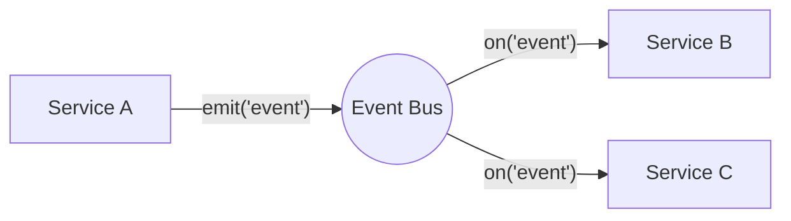
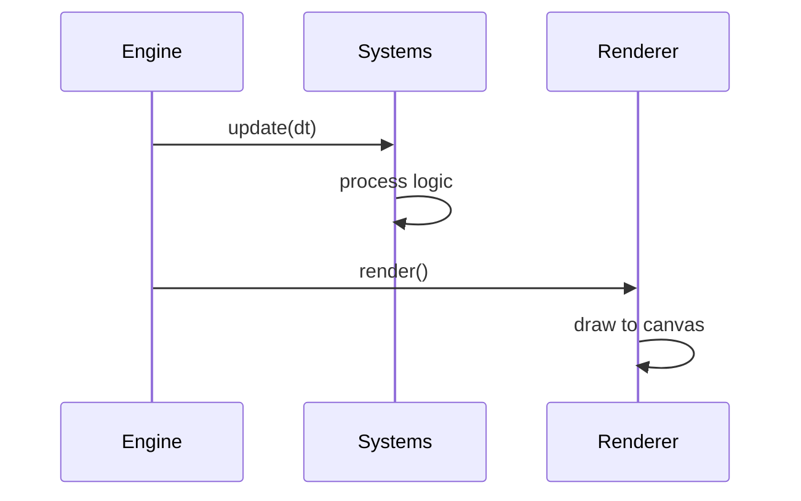
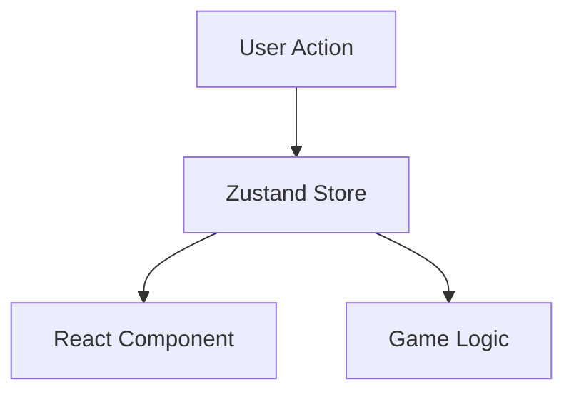

# Architecture Diagrams (Mermaid)

Bu dosya, projedeki mimariyi görselleştirmek için kullanılacak Mermaid.js şablonlarını içerir.

## Servisler Arası İletişim (EventBus)

## Oyun Döngüsü (Game Loop)

## State Flow (Zustand)

