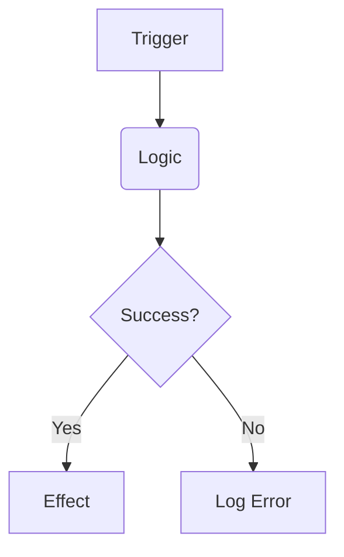

# Feature: [Özellik Adı]

## Özet
Bu özelliğin amacı ve oyuncu deneyimine katkısı nedir?

## Mimari Yaklaşım
- **Logic**: Hangi servis veya sistem bu özelliği yönetiyor?
- **State**: Hangi Zustand store'ları veya local state'ler kullanılıyor?
- **Rendering**: Canvas üzerinde nasıl bir görselleştirme yapılıyor?

## Veri Yapıları
```typescript
// Temel tip tanımları ve interface'ler
interface FeatureState {
  // ...
}
```

## Akış Diyagramı (Mermaid)


## Anti-Cheat ve Güvenlik
Bu özellik hileye açık mı? Nasıl bir koruma sağlandı?

## Performans Notları
- FPS üzerindeki etkisi.
- Memory allocation (Pooling kullanımı vb.).
