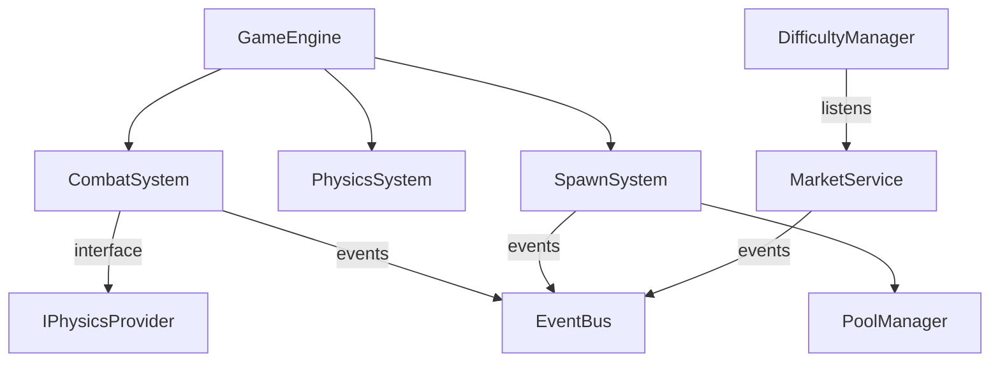

# 🔍 Scalability Review & Modularization Workflow
## Crypto Cyber Survivors - Sistemleri Bağımsızlaştırma ve Debug-Friendly Hale Getirme

> **Amaç:** Mevcut sistemleri inceleyerek bağımlılıklarını azaltmak, modüler geliştirmeye açık hale getirmek ve debug edilmesi kolay bir yapı oluşturmak.

---

## 📋 Workflow Özeti

Bu workflow tek bir sistem için değil, **projenin tamamında** kullanılacak bir inceleme ve iyileştirme sürecidir. Her sistem için aşağıdaki aşamalar tekrarlanır.

---

## 🎯 FAZE 1: Sistem Envanteri ve Bağımlılık Haritası

### Adım 1.1: Tüm Sistemleri Listele
// ultrathink
Projedeki tüm temel sistemleri kategorize et:

**Analiz Edilecek Sistem Grupları:**
```
1. CORE SERVICES (services/*.ts)
   - EventBus, Logger, GameStateMachine, GameStateManager
   - TimeService, ScreenService, DeviceBenchmarkService

2. GAME MECHANICS (services/)
   - CombatSystem, PhysicsSystem, SpawnSystem
   - DifficultyManager, ComboSystem, MilestoneService

3. MARKET INTEGRATION (services/)
   - MarketService, MarketStateService
   - services/indicators/*

4. PLAYER & ENTITIES (services/)
   - PoolManager, SpatialGrid
   - cards/*, patterns/*

5. AUDIO & VISUAL (services/)
   - AudioService, audio/*
   - renderers/*, ParticleConfigService

6. ANALYTICS & METRICS (services/)
   - MetricsService, metrics/*
   - analytics/*

7. EXTERNAL INTEGRATIONS
   - Supabase.ts, auth/*
   - verification/*

8. STORES (stores/)
   - gameStore, admin/configStore

9. HOOKS (hooks/)
   - useGameEvents, useMarketData, useHUDEvents, etc.

10. CONFIG (config/)
    - GameConfig, StatRegistry, EnemyRegistry, etc.
```

**Yapılacak:**
- Her kategorideki dosyaları listele
- Dosya boyutlarını not al (büyük dosyalar = god class riski)
- Tek sorumluluk ilkesine uygunluğu değerlendir

---

### Adım 1.2: Global Bağımlılık Haritası Oluştur
// ultrathink

Her sistem için şu soruları yanıtla:
1. **Kimler bu sistemi kullanıyor?** (import edenler)
2. **Bu sistem kimleri kullanıyor?** (import ettikleri)
3. **EventBus üzerinden hangi event'leri dinliyor/yayınlıyor?**
4. **Zustand store erişimi var mı?**
5. **Singleton pattern kullanıyor mu?**

**Bağımlılık Komutları:**
```bash
# Belirli bir sistemi kim import ediyor?
grep -r "from.*[SystemName]" --include="*.ts" --include="*.tsx" | grep -v test

# Bu sistem kimleri import ediyor?
head -50 services/[SystemName].ts | grep "^import"

# EventBus kullanımı
grep -r "EventBus\.emit\|EventBus\.on" services/[SystemName].ts
```

**Çıktı:** Her sistem için bağımlılık kartı oluştur:
```
┌─────────────────────────────────────────┐
│ SYSTEM: CombatSystem                    │
├─────────────────────────────────────────┤
│ IMPORTS FROM: 6 modules                 │
│ - PoolManager, PhysicsSystem            │
│ - BuffManager, ComboSystem              │
│ - EventBus, gameStore                   │
├─────────────────────────────────────────┤
│ IMPORTED BY: 3 modules                  │
│ - GameEngine, useGameEvents             │
│ - SpawnSystem                           │
├─────────────────────────────────────────┤
│ EVENTS EMITTED: enemyKilled, comboHit   │
│ EVENTS LISTENED: playerHit, gameReset   │
├─────────────────────────────────────────┤
│ COUPLING SCORE: 7/10 (Yüksek)           │
│ SUGGESTION: BuffManager'ı inject et     │
└─────────────────────────────────────────┘
```

---

## 🎯 FAZE 2: Tekil Sistem Analizi

Her sistem için aşağıdaki adımları uygula:

### Adım 2.1: Sistem Dosyasını İncele
// turbo
```bash
# Dosya outline'ına bak
view_file_outline ile dosyanın yapısını anla
```

// ultrathink
**Analiz Kriterleri:**
1. **Single Responsibility:** Sadece bir iş mi yapıyor?
2. **Interface Segregation:** Gereksiz public metodlar var mı?
3. **Dependency Inversion:** Concrete sınıflara mı, interface'lere mi bağımlı?
4. **Open/Closed:** Yeni özellik için mevcut kodu değiştirmek gerekiyor mu?
5. **Testability:** Mock edilebilir mi? Bağımlılıkları inject edilebilir mi?

**Kod Kokuları (Code Smells) Kontrol Listesi:**
- [ ] 300+ satır dosya → Bölünmeli
- [ ] 5+ import statement → Çok bağımlı
- [ ] getInstance() kullanımı → Singleton coupling
- [ ] EventBus.emit() 3+ yerde → Event karmaşası
- [ ] gameStore.getState() doğrudan erişim → Store coupling
- [ ] try-catch içinde iş mantığı → Error handling karışık
- [ ] Magic number/string → Config'e taşınmalı
- [ ] Tekrarlayan kod blokları → Extract method

---

### Adım 2.2: Bağımlılık Tipi Analizi
// ultrathink

Bağımlılıkları kategorize et:

| Tip | Açıklama | Aksiyon |
|-----|----------|---------|
| **Essential** | İşlevsellik için zorunlu | Koru, interface ekle |
| **Convenience** | Kolaylık için | Inject et veya parametre yap |
| **Circular** | Döngüsel bağımlılık | Hemen kır |
| **God Object** | Her şeye bağlı | Parçala |
| **Transitive** | A→B→C (A, C'yi bilmemeli) | Facade pattern |

**Döngüsel Bağımlılık Tespiti:**
```bash
# Circular dependency check
npx madge --circular --extensions ts,tsx services/
```

---

### Adım 2.3: Modülerlik Skoru Hesapla
// ultrathink

Her sistem için 1-10 arası skor ver:

```
MODULARITY SCORECARD
====================
System: [SystemName]
─────────────────────────────────────
Cohesion (İç Tutarlılık):      ?/10
  - Tüm metodlar aynı amaca mı hizmet ediyor?

Coupling (Dış Bağımlılık):     ?/10
  - Diğer sistemlere ne kadar bağlı?

Testability (Test Edilebilirlik): ?/10
  - Bağımlılıklar mock edilebilir mi?

Extensibility (Genişletilebilirlik): ?/10
  - Yeni özellik eklemek kolay mı?

Debug Friendliness (Debug Kolaylığı): ?/10
  - Hatalar izlenebilir mi?
─────────────────────────────────────
TOTAL SCORE:                   ?/50
```

---

## 🎯 FAZE 3: İyileştirme Stratejisi

### Adım 3.1: Öncelik Belirleme
// ultrathink

Sistemleri iyileştirme önceliğine göre sırala:

**Öncelik Matrisi:**
```
        │ YÜKSEK ETKİ      │ DÜŞÜK ETKİ
────────┼──────────────────┼──────────────────
KOLAY   │ ⭐ İLK YAP       │ Fırsat gelince
FIX     │ (Quick Wins)     │ (Nice to have)
────────┼──────────────────┼──────────────────
ZOR     │ Planlı refactor  │ ❌ ATLA
FIX     │ (Major effort)   │ (Değmez)
────────┴──────────────────┴──────────────────
```

**Quick Win Kriterleri:**
1. < 1 saat iş
2. Test değişikliği gerektirmez
3. Breaking change yok
4. Büyük etki (5+ dosyayı etkiler)

---

### Adım 3.2: Modülerleştirme Teknikleri

// ultrathink

Her sistem için uygun tekniği seç:

**A. Interface Extraction**
```typescript
// ÖNCE
class CombatSystem {
  constructor() {
    this.physics = PhysicsSystem.getInstance(); // Tight coupling
  }
}

// SONRA
interface IPhysicsProvider {
  checkCollision(a: Entity, b: Entity): boolean;
}

class CombatSystem {
  constructor(private physics: IPhysicsProvider) {} // Loose coupling
}
```

**B. Event-Based Decoupling**
```typescript
// ÖNCE
combatSystem.notifyComboSystem(combo); // Direct call

// SONRA
EventBus.emit({ type: 'comboTriggered', data: combo }); // Event-based
```

**C. Facade Pattern**
```typescript
// Birden fazla service'i tek interface arkasına gizle
class GameFacade {
  constructor(
    private combat: CombatSystem,
    private physics: PhysicsSystem,
    private spawn: SpawnSystem
  ) {}
  
  processFrame(dt: number): void {
    // Orchestration logic
  }
}
```

**D. Strategy Pattern**
```typescript
// Davranışları değiştirilebilir hale getir
interface ISpawnStrategy {
  calculateSpawnRate(): number;
}

class DefaultSpawnStrategy implements ISpawnStrategy { }
class MarketBasedSpawnStrategy implements ISpawnStrategy { }
```

---

### Adım 3.3: Debug Kolaylığı İyileştirmeleri

// ultrathink

Her sisteme debug yetenekleri ekle:

**1. State Inspection**
```typescript
class System {
  // Debug için anlık durumu döndür
  getDebugState(): DebugInfo {
    return {
      systemName: 'CombatSystem',
      activeEntities: this.entities.length,
      lastProcessTime: this.lastDt,
      pendingEvents: this.eventQueue.length,
    };
  }
}
```

**2. Event Tracing**
```typescript
// EventBus'a trace mode ekle
EventBus.enableTracing(); // Tüm event'leri logla
EventBus.getEventHistory(); // Son N eventi göster
```

**3. Performance Markers**
```typescript
// Performans ölçümü için marker'lar
performance.mark('combat-start');
this.processCombat();
performance.mark('combat-end');
performance.measure('combat', 'combat-start', 'combat-end');
```

**4. Isolated Testing Mode**
```typescript
// Sistemi izole test etme
class CombatSystem {
  static createTestInstance(): CombatSystem {
    return new CombatSystem(
      mockPhysics,
      mockBuffManager,
      mockEventBus
    );
  }
}
```

---

## 🎯 FAZE 4: Uygulama ve Doğrulama

### Adım 4.1: Değişiklikleri Uygula
// turbo
```bash
# Önce mevcut durumu kaydet
npm run test
npm run lint
```

Her değişiklik için:
1. Tek bir modifikasyon yap
2. Lint kontrol et
3. İlgili testleri çalıştır
4. Commit at

---

### Adım 4.2: Coupling Metriklerini Doğrula
// turbo
```bash
# Bağımlılık analizi tekrarla
npx madge --circular --extensions ts,tsx services/

# Import sayısı kontrolü
grep -c "^import" services/*.ts | sort -t: -k2 -rn
```

**Hedefler:**
- [ ] Circular dependency: 0
- [ ] Max import per file: < 10
- [ ] Max file size: < 400 lines
- [ ] All systems have interface

---

### Adım 4.3: Test Coverage Kontrolü
// turbo
```bash
npm run test:coverage
```

Hedef: Her refactor edilen sistem için %80+ coverage

---

## 🎯 FAZE 5: Dokümantasyon

### Adım 5.1: Sistem Bağımlılık Diyagramı Oluştur
// ultrathink

ASCII art veya Mermaid diagram ile sistemler arası ilişkileri görselleştir:



---

### Adım 5.2: API Dokümantasyonu
// turbo

Her sistem için public API'yi belgele:
```typescript
/**
 * CombatSystem - Handles all combat-related calculations
 * 
 * @dependencies
 *   - IPhysicsProvider (collision detection)
 *   - EventBus (communication)
 * 
 * @events-emitted
 *   - enemyKilled: When enemy is destroyed
 *   - playerDamaged: When player takes damage
 * 
 * @events-listened
 *   - gameReset: Clears all combat state
 */
```

---

## 📊 Çıktı Şablonu

Her inceleme sonunda şu raporu oluştur:

```
═══════════════════════════════════════════════════════
SCALABILITY REVIEW REPORT
Date: [DATE]
Systems Analyzed: [COUNT]
═══════════════════════════════════════════════════════

## EXECUTIVE SUMMARY
[1-2 paragraf genel değerlendirme]

## CRITICAL FINDINGS
1. [Finding 1]
2. [Finding 2]

## QUICK WINS (Hemen yapılabilir)
- [ ] [Action 1]
- [ ] [Action 2]

## MAJOR REFACTORS (Planlı yapılmalı)
- [ ] [Refactor 1]
- [ ] [Refactor 2]

## SYSTEM SCORECARDS
[Her sistem için scorecard]

## DEPENDENCY MAP
[ASCII diagram]

## RECOMMENDED ORDER OF WORK
1. [First system to fix]
2. [Second system to fix]
...

═══════════════════════════════════════════════════════
```

---

## 🔁 Tekrarlama Döngüsü

Bu workflow tek seferlik değil, sürekli kullanılmalı:

1. **Haftalık:** Quick wins kontrol
2. **Sprint başı:** Major refactor planlama
3. **Feature sonrası:** Yeni eklenen sistemin uyumluluğu
4. **Release öncesi:** Genel sağlık kontrolü

---

## ⚡ Turbo Komutları

Hızlı erişim için sık kullanılan komutlar:

// turbo-all
```bash
# Tam analiz
npm run lint && npm run test

# Dependency check
npx madge --circular --extensions ts,tsx services/

# File size check (büyük dosyaları bul)
find services -name "*.ts" -exec wc -l {} + | sort -rn | head -20

# Import count
grep -c "^import" services/*.ts | sort -t: -k2 -rn | head -10
```

---

> **Not:** Bu workflow kod değişikliği içermez. Sadece analiz ve planlama adımlarından oluşur. Gerçek değişiklikler için `/refactor` veya `/refactor-2` workflow'larını kullan.
