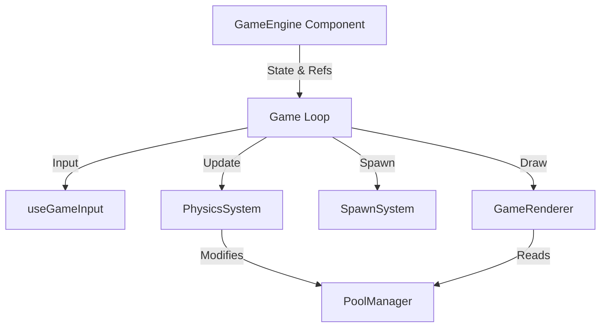

# Game Engine Refactor Roadmap

This document outlines the plan to refactor `components/GameEngine.tsx` from a monolithic "God Class" into a modular, testable architecture.

## 🎯 Objective
To decouple Rendering, Input, Physics, and Game Logic, improving maintainability and performance.

## Phase 1: Preparation & Input/Config Decoupling (Easy Wins)
*Goal: Clean up the file header and remove non-core responsibilities without breaking game logic.*

- [x] **1.1. Extract Types:** Move local interfaces (`Candle`, `GameEngineProps`) to `types/game.ts` or `types.ts`.
- [x] **1.2. Extract Constants:** Ensure all magic numbers (speeds, colors, sizes) are in `constants.ts` or `config/gameConfig.ts`.
- [x] **1.3. Extract Input Logic:** Create `hooks/useGameInput.ts`.
    -   Move `handleKeyDown`, `handleKeyUp`, and `keys` state here.
    -   Hook should return normalized vectors `{ dx, dy }` and `isFiring`.

## Phase 2: Core Logic Separation (The Heavy Lifting)
*Goal: Remove "Game Logic" from the React Component. The Component should only be the "View" and "Controller".*

- [x] **2.1. Create Physics System:** Create `systems/PhysicsSystem.ts`.
    -   Implement `checkCollisions(pool, player)` method.
    -   Move the nested loops for Bullet-Enemy, Enemy-Player, Gem-Player collisions here.
- [x] **2.2. Create Spawn System:** Create `systems/SpawnSystem.ts`.
    -   Move `spawnTimer` logic and position calculation (`edge` randomizer) here.
    -   Method: `SpawnSystem.getNextSpawn(width, height, difficulty, time)`.

## Phase 3: Visual Separation (Rendering & UI)
*Goal: Separate the "Paint" logic from the "Simulation" logic.*

- [x] **3.1. Create Renderer:** Create `systems/GameRenderer.ts` or `systems/CanvasRenderer.ts`.
    -   Move the 200+ line `draw()` function into a class.
    -   Methods: `drawBackground`, `drawEntities`, `drawUI`.
    -   GameEngine calls `renderer.render(ctx, state, pool)`.
- [x] **3.2. HUD Extraction (Optional but Recommended):**
    -   Move `fillText` based UI (Combo text, Level Up flash) to pure React components overlaid on the Canvas.
    -   This improves performance (no canvas text rendering) and makes styling easier (CSS).

## Architecture Overview (Target State)

## Next Steps
Start with **Phase 1.3** (Input Hook) or **Phase 3.1** (Renderer) to see immediate reduction in file size.
