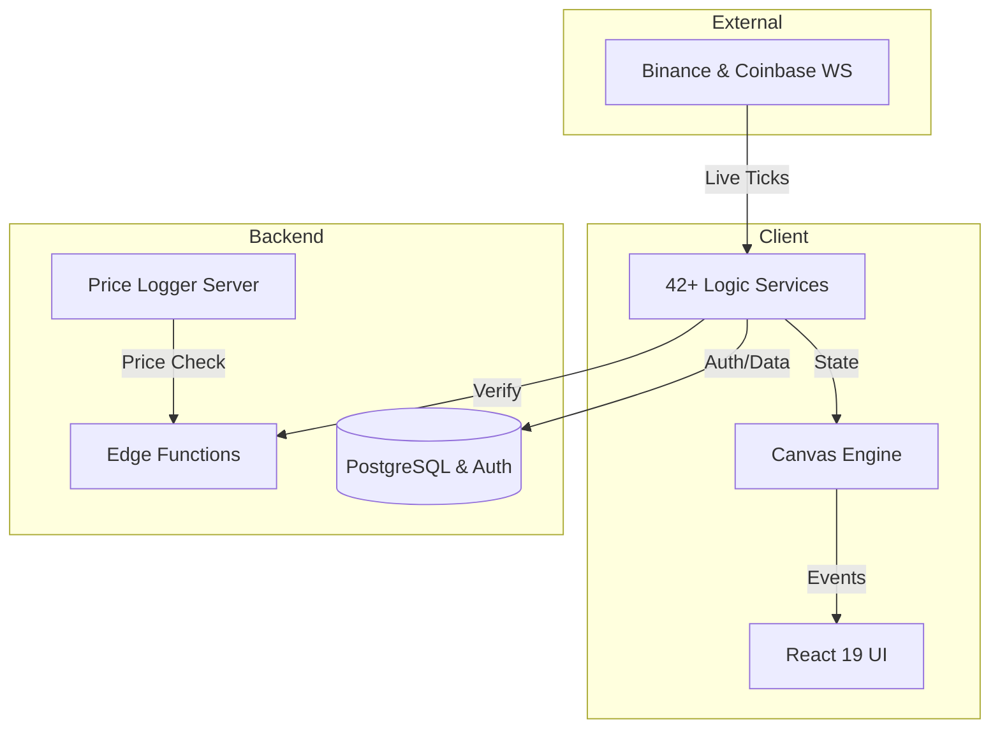

# :Cpu: System Architecture

> **Status**: Production Ready (Beta) | **Type**: Full-Stack Architecture | **Domain**: Real-time Gaming & Web3

## :FileText: System Summary
The Crypto Survivors architecture is a hybrid system that blends a high-performance game engine (Canvas API) with real-time market data (WebSocket) and a secure backend (Supabase). The system manages thousands of entities with low latency while prioritizing cheat protection and data integrity.

## :Rocket: Core Pillars (Temel İlkeler)
- **Service-Oriented Singleton Pattern**: All logic is encapsulated in independent, testable singleton services.
- **Event-Driven Communication**: Services communicate via a type-safe `EventBus`.
- **High-Performance Game Loop**: Optimized Canvas render loop targeting 60 FPS, decoupled from React state updates.
- **Object Pooling & Spatial Hashing**: Efficient memory management via O(1) pooling and optimized collision detection using spatial grids.

## :Monitor: Architecture Overview

## :Settings: Technical Stack
| Layer | Technologies |
| :--- | :--- |
| **Frontend** | React 19, TypeScript 5, Vite, Zustand, Framer Motion |
| **DevOps** | Vitest (Unit/Integration), Playwright (E2E), ESLint, Prettier |
| **Infrastructure** | Supabase (PostgreSQL, Auth, Realtime, Functions), Railway |
| **Data** | WebSocket (Binance/Coinbase), Zod Validation |

## :Target: Key Systems
- **Combat & Physics**: O(1) object pooling and O(N) collision detection.
- **Difficulty V2**: Real-time BTC price-sensitive difficulty supported by a neural AI Director.
- **Security**: Client-side AntiCheat + Server-side Edge Function verification.
- **Sound Engine**: Dynamic SFX and music management based on Web Audio API.

## :Zap: Performance & Security (Performans ve Güvenlik)
- **Performance**: Near-zero memory allocation during gameplay thanks to GC-free loop logic.
- **Security**: Row Level Security (RLS), HMAC data signing, and device fingerprinting.

---
// END OF PROTOCOL
