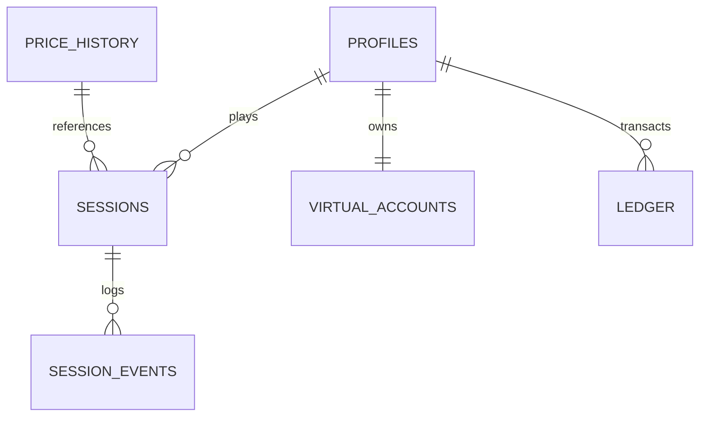

# :Database: Database Architecture (Supabase Renaissance)

> **Status**: Production Ready (v1.0.0) | **Type**: PostgreSQL / Supabase | **Domain**: Data Integrity & Persistence

## :FileText: Database Summary
The Crypto Survivors database architecture is built on high scalability, data integrity, and financial auditability. The "Renaissance" schema provides full protection with Row Level Security (RLS) policies, while the Ledger system securely records every in-game economic movement.

## :Rocket: Key Features
- **Financial Integrity (Ledger)**: Immutable `ledger` table for all transactions ensures a perfect audit trail.
- **Optimized Time-Series Data**: BRIN indexes on market data (`price_history`) allow high-performance querying over millions of rows.
- **Relational Integrity**: UUID-based keys and strict Foreign Key constraints guarantee data consistency.

## :Monitor: ER Diagram

## :Trophy: Table Groups
| Category | Tables | Description |
| :--- | :--- | :--- |
| **Identity** | `profiles`, `identities` | User profiles and authentication methods. |
| **Economy** | `virtual_accounts`, `ledger` | Balances and transaction history (Audit). |
| **Gameplay** | `sessions`, `achievements` | Game sessions, rewards, and unlocks. |
| **Market** | `price_history`, `indicators` | Real-time and historical market data. |

## :Settings: Technical Context
- **RLS Policies**: Strict SQL policies for "anon" and "authenticated" roles implemented on every table.
- **Data Types**: `BIGINT` (for sub-units) and `NUMERIC` (for prices) used for financial precision.
- **Performance**: B-Tree and BRIN indexes active on high-frequency `profile_id` and `timestamp` columns.

## :Zap: Performance & Security Level
- **Performance**: PostgreSQL 15+ features and intelligent indexing ensure sub-100ms query response times.
- **Security**: Database-level triggers for automatic balance validation and cross-check via `verify-game` edge function.

---
// END OF PROTOCOL