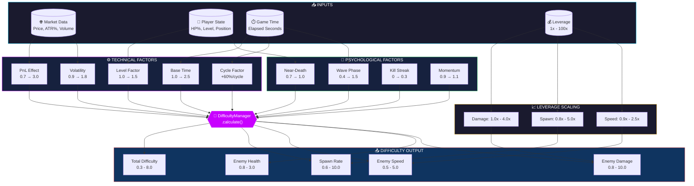

# 🎮 Crypto Cyber Survivors - Difficulty System Analysis

> **Comprehensive Code Review of Game Difficulty, Enemy Spawning, and Core Game Loop**
> Status: ✅ COMPLETED
> Created: 2026-01-21

---

## 📋 Executive Summary

This document provides a **in-depth mathematical analysis** of the game's difficulty system, enemy spawn mechanics, and core game loop. The analysis covers how various factors (leverage, PnL, volatility, wave phases, player state) combine to create dynamic gameplay.

### Key System Components

1. **DifficultyManager** - Central calculation hub combining 12+ factors
2. **SpawnSystem** - Enemy spawning based on difficulty output
3. **EnemyFactory** - Enemy stat scaling based on difficulty
4. **GameEngine** - Core loop orchestrating all systems

---

## 📊 System Flow Diagrams

### Main Difficulty Calculation Flow



---

### Enemy Spawn Flow

```mermaid
flowchart LR
    subgraph TRIGGER["⏰ Spawn Trigger"]
        TIMER[spawnTimer += deltaTime]
        THRESH{timer > threshold?}
    end

    subgraph CALC_THRESH["📊 Threshold Calculation"]
        BASE[baseInterval: 800ms]
        DIFF[difficulty × 0.5]
        WAVE_INT[× waveIntensity]
        SPAWN_MULT[× spawnRateMultiplier]
        FINAL_T[threshold = base / scaled]
    end

    subgraph TYPE_SELECT["👾 Enemy Type Selection"]
        THEMATIC{70% Thematic?}
        LOSING{Player Losing?}
        BEAR[🐻 Bear]
        BULL[🐂 Bull]
        VARIANT{30% Variant}
        FUD[💨 FUD]
        LIQ[⚡ Liquidator]
        PUMP[📈 PumpDump]
    end

    subgraph SPECIAL["🌟 Special Spawns"]
        WHALE_CHECK{whaleTier > 0?}
        RSI_CHECK{RSI ≠ Neutral?}
        WHALE[🐋 Whale Enemy]
        RSI_ENM[📊 RSI Enemy]
    end

    subgraph POOL["🏊 Pool Manager"]
        GET_E[pool.getEnemy]
        FACTORY[EnemyFactory.createEnemy]
        ACTIVE[activeEnemies.push]
    end

    TIMER --> THRESH
    THRESH -->|Yes| TYPE_SELECT
    THRESH -->|No| TIMER

    BASE --> DIFF --> WAVE_INT --> SPAWN_MULT --> FINAL_T
    FINAL_T --> THRESH

    THEMATIC -->|Yes| LOSING
    LOSING -->|Yes| BEAR
    LOSING -->|No| BULL
    THEMATIC -->|No| VARIANT
    VARIANT -->|<0.4| FUD
    VARIANT -->|<0.7| LIQ
    VARIANT -->|else| PUMP

    WHALE_CHECK -->|Yes| WHALE
    RSI_CHECK -->|Yes| RSI_ENM

    BEAR --> GET_E
    BULL --> GET_E
    FUD --> GET_E
    LIQ --> GET_E
    PUMP --> GET_E
    WHALE --> GET_E
    RSI_ENM --> GET_E

    GET_E --> FACTORY --> ACTIVE

    style TRIGGER fill:#1a1a2e,stroke:#00d4ff
    style CALC_THRESH fill:#16213e,stroke:#c800ff
    style TYPE_SELECT fill:#16213e,stroke:#22c55e
    style SPECIAL fill:#0f3460,stroke:#fbbf24
    style POOL fill:#1a1a2e,stroke:#ef4444
```



---

### Wave Phase Cycle (5 Minutes)

```mermaid
gantt
    title 🌊 Wave Phase Timeline (300 seconds = 5 minutes)
    dateFormat ss
    axisFormat %S

    section Phases
    Warmup (0.75x)       :w1, 00, 25s
    Buildup (0.80x)      :b1, after w1, 60s
    First Peak (1.30x)   :crit, fp1, after b1, 30s
    Breather (0.60x)     :br1, after fp1, 45s
    Escalation (1.10x)   :e1, after br1, 60s
    Climax (1.50x)       :crit, c1, after e1, 45s
    Resolution (0.40x)   :r1, after c1, 15s
```



---

### Core Game Loop

```mermaid
flowchart TB
    subgraph FRAME["🎬 Per-Frame Update (~16ms)"]
        direction TB
        
        RAF[requestAnimationFrame]
        
        subgraph TIME_CALC["⏱️ Time"]
            DT[deltaTime = TimeService.update]
            SCALE[timeScale = nearMiss ? 0.3 : 1.0]
        end
        
        subgraph SYSTEMS["🔧 System Updates"]
            DIFF_UP[DifficultyManager.updateWaveTimer]
            COMBO[ComboSystem.update]
            BUFF[BuffManager.update]
            METRICS[MetricsService.update]
        end
        
        subgraph SPAWN_UPDATE["👾 Spawning"]
            SPAWN_SYS[SpawnSystem.update]
            BUFF_GEM[BuffGemSpawner.update]
        end
        
        subgraph PHYSICS["⚡ Physics"]
            PHYS_ENT[PhysicsSystem.updateEntities]
            PHYS_COL[PhysicsSystem.handleCollisions]
        end
        
        subgraph COMBAT["⚔️ Combat"]
            AUTO_FIRE[CombatSystem.processAutoFire]
        end
        
        subgraph RENDER["🎨 Render"]
            DRAW[GameRenderer.render]
        end
    end

    RAF --> TIME_CALC
    TIME_CALC --> SYSTEMS
    SYSTEMS --> SPAWN_UPDATE
    SPAWN_UPDATE --> PHYSICS
    PHYSICS --> COMBAT
    COMBAT --> RENDER
    RENDER --> RAF

    style FRAME fill:#0a0a0a,stroke:#c800ff
    style TIME_CALC fill:#1a1a2e,stroke:#00d4ff
    style SYSTEMS fill:#16213e,stroke:#22c55e
    style SPAWN_UPDATE fill:#16213e,stroke:#fbbf24
    style PHYSICS fill:#0f3460,stroke:#ef4444
    style COMBAT fill:#0f3460,stroke:#ff6b6b
    style RENDER fill:#1a1a2e,stroke:#c800ff
```



---

### Data Flow: Market → Enemy Stats

```mermaid
flowchart LR
    subgraph WS["🌐 WebSocket"]
        BINANCE[Binance WS]
        COINBASE[Coinbase WS]
    end

    subgraph MARKET_SVC["📡 MarketService"]
        CONNECT[connect]
        FALLBACK[fallback logic]
        CALLBACK[onData callback]
    end

    subgraph HOOK["🪝 useMarketData"]
        CALC_PNL[MarketCalculator.calculatePnL]
        CALC_ATR[MarketCalculator.calculateATR]
        DIFF_CALC[DifficultyManager.calculate]
    end

    subgraph OUTPUT_DATA["📤 MarketData"]
        MD_DIFF[difficulty: number]
        MD_DMG[enemyDamage: number]
        MD_SPD[enemySpeed: number]
    end

    subgraph ENGINE["🎮 GameEngine"]
        SPAWN_CALL[SpawnSystem.update]
        POOL_CALL[PoolManager.getEnemy]
    end

    subgraph FACTORY["🏭 EnemyFactory"]
        CREATE[createEnemy]
        SCALE_HP[health × difficultyScale]
        SCALE_DMG[damage × damageMultiplier]
        SCALE_SPD[speed × speedMultiplier]
    end

    subgraph ENEMY["👾 GameEnemy"]
        E_HP[health]
        E_DMG[damage]
        E_SPD[speed]
    end

    BINANCE --> CONNECT
    COINBASE --> FALLBACK
    CONNECT --> CALLBACK
    FALLBACK --> CALLBACK
    
    CALLBACK --> CALC_PNL
    CALLBACK --> CALC_ATR
    CALC_PNL --> DIFF_CALC
    CALC_ATR --> DIFF_CALC
    
    DIFF_CALC --> MD_DIFF
    DIFF_CALC --> MD_DMG
    DIFF_CALC --> MD_SPD
    
    MD_DIFF --> SPAWN_CALL
    MD_DMG --> SPAWN_CALL
    MD_SPD --> SPAWN_CALL
    
    SPAWN_CALL --> POOL_CALL
    POOL_CALL --> CREATE
    
    CREATE --> SCALE_HP --> E_HP
    CREATE --> SCALE_DMG --> E_DMG
    CREATE --> SCALE_SPD --> E_SPD

    style WS fill:#1a1a2e,stroke:#00d4ff
    style MARKET_SVC fill:#16213e,stroke:#22c55e
    style HOOK fill:#16213e,stroke:#c800ff
    style OUTPUT_DATA fill:#0f3460,stroke:#fbbf24
    style ENGINE fill:#1a1a2e,stroke:#ef4444
    style FACTORY fill:#16213e,stroke:#ff6b6b
    style ENEMY fill:#0f3460,stroke:#c800ff
```



---

## 🔢 Mathematical Formulas

### 1. Final Difficulty Calculation

The total difficulty is calculated as:

```
Total Difficulty = clamp(Technical × Psychological × Momentum, 0.3, maxDifficulty)

Where:
  Technical = BaseTime × PnLEffect × Volatility × LevelFactor × CycleFactor × BaseMultiplier
  Psychological = WaveMultiplier × NearDeathMod × (1 + StreakBonus)
```

**Default Range:** `0.3` to `8.0` (configurable via admin)

---

### 2. Individual Factor Breakdown

#### 2.1 Base Time Factor (`baseTime`)

```typescript
baseTimeFactor = min(2.5, 1 + (elapsedSeconds / 60) × 0.15)
```

| Time (min) | Factor |
|------------|--------|
| 0          | 1.00   |
| 1          | 1.15   |
| 2          | 1.30   |
| 5          | 1.75   |
| 10         | 2.50 (capped) |

**Effect:** Difficulty increases 15% per minute, capped at 2.5x after ~10 minutes.

---

#### 2.2 PnL Effect (`pnlEffect`)

```typescript
// Leverage-amplified PnL
leverageEffect = pnl × leverage × 5.0

// If losing (leverageEffect < 0):
pnlFactor = min(3.0, 1 + log1p(|leverageEffect|) × 0.5)

// If winning (leverageEffect >= 0):
pnlFactor = max(0.7, 1 - log1p(leverageEffect) × 0.15)
```

| PnL (%) | 1x Lever | 10x Lever | 100x Lever |
|---------|----------|-----------|------------|
| +5%     | 0.89     | 0.74      | 0.70 (floor) |
| 0%      | 1.00     | 1.00      | 1.00       |
| -5%     | 1.11     | 1.47      | 1.75       |
| -10%    | 1.20     | 1.62      | 1.95       |

**Effect:** Losing increases difficulty logarithmically (capped at 3x), winning decreases it (floored at 0.7x).

---

#### 2.3 Volatility Factor (`volatility`)

```typescript
// Base volatility from ATR%
baseVolatility = clamp(1 + atrPercent × 50, 0.9, 1.8)

// Time-based damping (early game volatility is dampened)
damping = min(1.0, 0.2 + (elapsedSeconds / 300) × 0.8)

// Final volatility
volatilityFactor = 1.0 + (baseVolatility - 1.0) × damping
```

| ATR% | Early (0s) | Mid (60s) | Late (300s+) |
|------|------------|-----------|--------------|
| 0.5% | 1.05       | 1.16      | 1.25         |
| 1.0% | 1.10       | 1.32      | 1.50         |
| 2.0% | 1.16       | 1.51      | 1.80 (capped)|

**Effect:** High market volatility increases difficulty, but is dampened early game to let players get established.

---

#### 2.4 Level Factor (`levelFactor`)

```typescript
levelFactor = min(1.5, 1 + (level - 1) × 0.05)
```

| Level | Factor |
|-------|--------|
| 1     | 1.00   |
| 5     | 1.20   |
| 10    | 1.45   |
| 11+   | 1.50 (capped) |

**Effect:** 5% increase per level, capped at 1.5x at level 11+.

---

#### 2.5 Wave Phase Multiplier (`waveMultiplier`)

The game operates on a **5-minute (300s) cycle** with 7 phases:

| Phase       | Duration | Multiplier | Cumulative Time |
|-------------|----------|------------|-----------------|
| warmup      | 25s      | 0.75       | 0:00 - 0:25     |
| buildup     | 60s      | 0.80       | 0:25 - 1:25     |
| firstPeak   | 30s      | 1.30       | 1:25 - 1:55     |
| breather    | 45s      | 0.60       | 1:55 - 2:40     |
| escalation  | 60s      | 1.10       | 2:40 - 3:40     |
| climax      | 45s      | 1.50       | 3:40 - 4:25     |
| resolution  | 15s      | 0.40       | 4:25 - 5:00     |

**Effect:** Creates "yo-yo" pattern of intensity spikes and relief periods.

---

#### 2.6 Near-Death Modifier (`nearDeathMod`)

```typescript
threshold = 20  // HP %
critical = 6.6  // HP % (threshold × 0.33)

if (hpPercent >= 20):
    nearDeathMod = 1.0
else:
    mercyStrength = (20 - hpPercent) / (20 - 6.6)
    nearDeathMod = max(0.7, 1.0 - mercyStrength × 0.3)
```

| HP % | Modifier |
|------|----------|
| 100% | 1.00     |
| 20%  | 1.00     |
| 15%  | 0.89     |
| 10%  | 0.78     |
| 5%   | 0.70 (floor) |

**Effect:** "Mercy" mechanic reduces difficulty when HP drops below 20%, fully applying at ~7% HP.

---

#### 2.7 Kill Streak Bonus (`streakBonus`)

```typescript
// Streak resets if kill interval > 3 seconds
streakBonus = min(0.3, floor(killStreak / 5) × 0.05)
```

| Kills | Bonus |
|-------|-------|
| 0-4   | 0.00  |
| 5-9   | 0.05  |
| 10-14 | 0.10  |
| 15-19 | 0.15  |
| 30+   | 0.30 (capped) |

**Effect:** Encourages aggressive play; difficulty increases 5% for every 5 consecutive kills (within 3s intervals).

---

#### 2.8 Momentum Modifier (`momentumMod`)

```typescript
// Compares last 10 PnL values vs previous 10
recentAvg = average(lastPnlValues.slice(-10))
olderAvg = average(lastPnlValues.slice(-20, -10))
trend = recentAvg - olderAvg

if (trend > 0): return 1.1  // Player improving → harder
if (trend < 0): return 0.9  // Player declining → easier
return 1.0
```

**Effect:** +10% difficulty if PnL is improving, -10% if declining.

---

#### 2.9 Cycle Factor (`cycleFactor`)

```typescript
cycleFactor = 1 + (cycleNumber - 1) × 0.6
```

| Cycle | Factor |
|-------|--------|
| 1     | 1.0    |
| 2     | 1.6    |
| 3     | 2.2    |
| 4     | 2.8    |
| 5     | 3.4    |

**Effect:** Each 5-minute cycle completion increases base difficulty by 60%.

---

### 3. Leverage Scaling (Enemy Stats)

The leverage directly scales enemy attributes:

```typescript
LEVERAGE_SCALING = {
  1:   { damage: 1.0, spawn: 0.8, speed: 0.9 },
  2:   { damage: 1.0, spawn: 0.8, speed: 0.9 },
  5:   { damage: 1.2, spawn: 1.3, speed: 1.1 },
  10:  { damage: 1.2, spawn: 1.3, speed: 1.1 },
  25:  { damage: 1.5, spawn: 1.8, speed: 1.25 },
  50:  { damage: 2.0, spawn: 2.5, speed: 1.4 },
  100: { damage: 4.0, spawn: 5.0, speed: 2.5 },
}
```

| Leverage | Damage Mult | Spawn Mult | Speed Mult |
|----------|-------------|------------|------------|
| 1x       | 1.0x        | 0.8x       | 0.9x       |
| 5x       | 1.2x        | 1.3x       | 1.1x       |
| 10x      | 1.2x        | 1.3x       | 1.1x       |
| 25x      | 1.5x        | 1.8x       | 1.25x      |
| 50x      | 2.0x        | 2.5x       | 1.4x       |
| 100x     | 4.0x        | 5.0x       | 2.5x       |

**Effect:** High leverage trades higher XP rewards for significantly more dangerous enemies.

---

## 🎯 Difficulty Output

The `DifficultyManager.calculate()` returns:

```typescript
interface DifficultyOutput {
  spawnRate: number;    // 0.6 to 10.0
  enemySpeed: number;   // 0.5 to 5.0
  enemyHealth: number;  // 0.8 to 3.0
  enemyDamage: number;  // 0.8 to 10.0
  total: number;        // 0.3 to 8.0
  factors: DifficultyFactors;
}
```

### Output Calculations

```typescript
// Spawn Rate
spawnRate = clamp(total × leverageSpawn × 1.6, 0.6, 10.0)

// Enemy Speed
enemySpeed = clamp(pnlEffect × volatility × waveMultiplier × leverageSpeed, 0.5, 5.0)

// Enemy Health
enemyHealth = clamp(baseTime × levelFactor, 0.8, 3.0)

// Enemy Damage
enemyDamage = clamp(baseTime × cycleFactor × pnlEffect × leverageDamage, 0.8, 10.0)
```

---

## 👾 Enemy Spawn System

### Spawn Rate Calculation

```typescript
// SpawnSystem.update()
scaledDifficulty = (1 + (difficulty - 1) × 0.5 × intensityMultiplier) × spawnRateMultiplier

// Base spawn interval (from admin config, default 800ms)
spawnThreshold = baseInterval / scaledDifficulty
```

| Difficulty | Threshold (ms) | Enemies/Second |
|------------|----------------|----------------|
| 1.0        | 800            | 1.25           |
| 2.0        | 533            | 1.88           |
| 3.0        | 400            | 2.50           |
| 5.0        | 267            | 3.75           |
| 8.0        | 178            | 5.63           |

### Enemy Type Distribution

```typescript
// Thematic Spawning (70% chance)
if (LONG && losing) or (SHORT && winning) → 'bear'
else → 'bull'

// Variant Spawning (30% chance)
roll < 0.4 → 'fud'
roll < 0.7 → 'liquidator'
else → 'pumpdump'
```

### Special Spawns

**Whale Spawn:** Triggered by backend indicator `whaleTier > 0` with probability damping
```typescript
probPerFrame = tierConfig.spawnChance × 0.1 × (deltaTime / 16.66)
// 20 second cooldown between whale spawns
```

**RSI Spawn:** Triggered by `rsiState !== 'NEUTRAL'`
```typescript
rsiProb = 0.08 × (deltaTime / 16.66)  // ~8% per second
```

---

## 👿 Enemy Base Stats

| Type       | Radius | Base HP | Base Speed | Base Damage | Weight |
|------------|--------|---------|------------|-------------|--------|
| bear       | 14     | 50      | 1.2        | 5           | 60     |
| bull       | 16     | 70      | 1.4        | 8           | 25     |
| fud        | 10     | 30      | 1.6        | 3           | 10     |
| whale      | 35     | 300     | 0.8        | 25          | 5      |
| liquidator | 12     | 40      | 1.5        | 10          | 8      |
| pumpdump   | 18     | 80      | 1.2        | 12          | 6      |
| rsi        | 13     | 60      | 1.8        | 6           | 10     |

### Difficulty-Scaled Stats

```typescript
// In EnemyFactory.createEnemy()
health = baseHealth × (1 + (difficulty - 1) × 0.2)
damage = baseDamage × damageMultiplier
speed = baseSpeed × aggroMultiplier × speedMultiplier
```

| Difficulty | HP Multiplier | Example Bear HP |
|------------|---------------|-----------------|
| 1.0        | 1.00          | 50              |
| 2.0        | 1.20          | 60              |
| 3.0        | 1.40          | 70              |
| 5.0        | 1.80          | 90              |
| 8.0        | 2.40          | 120             |

---

## 🎮 Core Game Loop Flow

```
┌─────────────────────────────────────────────────────────────┐
│                     GAME ENGINE UPDATE                       │
└─────────────────────────────────────────────────────────────┘
                              │
                              ▼
┌─────────────────────────────────────────────────────────────┐
│ 1. TimeService.update() - Calculate deltaTime               │
│ 2. DifficultyManager.updateWaveTimer() - Sync wave phase   │
│ 3. BuffManager.update() - Update buff effects              │
│ 4. MetricsService.update() - Track analytics               │
└─────────────────────────────────────────────────────────────┘
                              │
                              ▼
┌─────────────────────────────────────────────────────────────┐
│                   MARKET DATA FLOW                           │
│                                                              │
│ MarketService → useMarketData → DifficultyManager.calculate │
│                                                              │
│ Inputs: pnl, atrPercent, playerLevel, hpPercent             │
│ Outputs: spawnRate, enemySpeed, enemyHealth, enemyDamage    │
└─────────────────────────────────────────────────────────────┘
                              │
                              ▼
┌─────────────────────────────────────────────────────────────┐
│                   SPAWN SYSTEM                               │
│                                                              │
│ SpawnSystem.update(deltaTime, difficulty, ...)               │
│   → spawnRegularEnemy() based on threshold                   │
│   → handleWhaleSpawning() based on indicators                │
│   → handleRSISpawning() based on momentum                    │
└─────────────────────────────────────────────────────────────┘
                              │
                              ▼
┌─────────────────────────────────────────────────────────────┐
│                   PHYSICS SYSTEM                             │
│                                                              │
│ PhysicsSystem.updateEntities() - Move all entities          │
│ PhysicsSystem.handleCollisions() - Damage & interactions    │
│                                                              │
│ CombatSystem.processAutoFire() - Auto-aim & shooting        │
└─────────────────────────────────────────────────────────────┘
                              │
                              ▼
┌─────────────────────────────────────────────────────────────┐
│                   RENDER SYSTEM                              │
│                                                              │
│ GameRenderer.render() - Draw all entities                   │
│   → Background candles (market visualization)               │
│   → Enemies, bullets, particles, gems                       │
│   → Player with effects (dash trail, halo)                  │
│   → UI overlays (damage numbers, buffs)                     │
└─────────────────────────────────────────────────────────────┘
```

---

## 📊 Example Scenarios

### Scenario 1: Early Game (1x Leverage, Neutral Market)

```
Time: 60s, Level: 3, HP: 100%, PnL: 0%, ATR: 1%

Factors:
  baseTime = 1.15
  pnlEffect = 1.0
  volatility = 1.32 (damped)
  levelFactor = 1.10
  waveMultiplier = 0.80 (buildup)
  cycleFactor = 1.0
  leverageScale = { damage: 1.0, spawn: 0.8, speed: 0.9 }

Technical = 1.15 × 1.0 × 1.32 × 1.10 × 1.0 = 1.67
Psychological = 0.80 × 1.0 × 1.0 = 0.80
Total = 1.67 × 0.80 = 1.34

Output:
  spawnRate = 1.34 × 0.8 × 1.6 = 1.72
  enemySpeed = 1.0 × 1.32 × 0.80 × 0.9 = 0.95
  enemyDamage = 1.15 × 1.0 × 1.0 × 1.0 = 1.15
```

### Scenario 2: Late Game (100x Leverage, Losing)

```
Time: 480s, Level: 15, HP: 15%, PnL: -8%, ATR: 2%

Factors:
  baseTime = 2.20
  pnlEffect = 2.31 (losing with 100x)
  volatility = 1.80 (max)
  levelFactor = 1.50 (capped)
  waveMultiplier = 1.50 (climax)
  cycleFactor = 1.6 (cycle 2)
  nearDeathMod = 0.78 (mercy at 15% HP)
  leverageScale = { damage: 4.0, spawn: 5.0, speed: 2.5 }

Technical = 2.20 × 2.31 × 1.80 × 1.50 × 1.6 = 21.95
Psychological = 1.50 × 0.78 × 1.0 = 1.17
Total = clamp(21.95 × 1.17, 0.3, 8.0) = 8.0 (capped)

Output:
  spawnRate = 8.0 × 5.0 × 1.6 = clamp(64, 0.6, 10.0) = 10.0
  enemySpeed = 2.31 × 1.80 × 1.50 × 2.5 = clamp(15.6, 0.5, 5.0) = 5.0
  enemyDamage = 2.20 × 1.6 × 2.31 × 4.0 = clamp(32.5, 0.8, 10.0) = 10.0
```

---

## ⚠️ Issues & Improvement Opportunities

### 1. **Difficulty Curve Too Steep at High Leverage**

**Problem:** At 100x leverage, the combination of factors can instantly hit the 8.0 cap, removing the progressive feel.

**Solution:** Consider adding a "soft cap" before the hard cap:
```typescript
// Soft cap at 6.0 with diminishing returns
if (total > 6.0) {
  total = 6.0 + (total - 6.0) * 0.3;
}
```

### 2. **Spawn Rate Scaling Mismatch**

**Problem:** `spawnRate` is multiplied by `leverageSpawn` (up to 5x) then by 1.6, resulting in values far exceeding the 10.0 cap at high difficulty.

**Current:** `spawnRate = clamp(total × leverageSpawn × 1.6, 0.6, 10.0)`

**Issue:** At difficulty 5.0 with 100x leverage:
- Unclamped: 5.0 × 5.0 × 1.6 = 40.0 → clamped to 10.0

This means there's no difference between difficulty 2.5+ at 100x leverage for spawn rate.

**Solution:** Consider separate scaling paths:
```typescript
spawnRate = clamp(total * 1.6, 0.6, 5.0) * leverageSpawn;
// This gives more granularity at high leverage
```

### 3. **Near-Death Mercy Not Strong Enough at Max Difficulty**

**Problem:** At 70% reduction (nearDeathMod = 0.7), a difficulty of 8.0 still results in 5.6, which is brutal.

**Solution:** Make mercy apply multiplicatively to the final output, not just the base calculation:
```typescript
const mercyAdjustedTotal = nearDeathMod < 1.0 
  ? total * nearDeathMod * 0.8  // Extra 20% reduction when in mercy
  : total;
```

### 4. **Wave Phase Duration Balance**

**Problem:** `resolution` phase (15s at 0.4x) is too short to meaningfully recover before the next cycle at higher difficulty.

**Solution:** Extend resolution to 25-30s, especially for cycle 2+:
```typescript
const resolutionDuration = 15 + (cycleNumber - 1) * 5; // 15s, 20s, 25s...
```

### 5. **Missing Leverage-Independent Difficulty Curve**

**Problem:** 1x and 2x leverage have identical scaling (`damage: 1.0, spawn: 0.8, speed: 0.9`).

**Solution:** Differentiate for better progression clarity:
```typescript
1:  { damage: 0.8, spawn: 0.6, speed: 0.8 },  // True "easy mode"
2:  { damage: 1.0, spawn: 0.8, speed: 0.9 },  // Normal mode
```

---

## 🔄 Recommended Next Steps

1. **Review Spawn Rate Formula** - Ensure meaningful progression at all leverage levels
2. **Add Soft Caps** - Prevent instant max difficulty at high leverage
3. **Extend Resolution Phase** - Better cycle recovery, especially late game
4. **Differentiate Low Leverage** - Make 1x truly easier than 2x
5. **Improve Mercy Mechanic** - Scale mercy with final difficulty, not just factors
6. **Add Visual Feedback** - Show current difficulty factors in debug/admin panel

---

## 📈 Testing Recommendations

1. **Unit Tests:** Verify each factor calculation in isolation
2. **Integration Tests:** Test full difficulty output at critical thresholds
3. **Play Testing:** Validate "feel" at 1x, 10x, 100x leverage across 3+ cycles
4. **Metrics Analysis:** Track average survival time vs leverage choice

---

*Document generated from code review of DifficultyManager.ts, SpawnSystem.ts, EnemyFactory.ts, and GameEngine.tsx*
