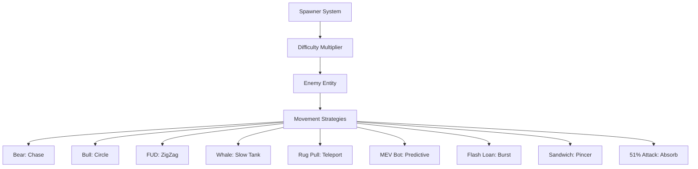

# :Skull: Enemy System Reference

> **Status**: Production Ready | **Type**: Game Design & AI | **Domain**: NPC Entities

## :FileText: System Summary
The Crypto Survivors enemy system is built upon 6 core entities representing different cryptocurrency market participants and events. The system dynamically scales enemy HP, speed, and aggression based on market volatility and player progression.

## :Rocket: Key Features
- **Diverse AI Patterns**: Unique movement and attack strategies for 6 distinct enemy types (ZigZag, Circle, Chase, etc.).
- :Target: **Dynamic Difficulty Scaling**: Enemy statistics are recalculated every second by the "Difficulty Manager" layer.
- :Trophy: **Experience Economy**: Each enemy type drops different amounts of Crystals (XP) and Coins based on its difficulty.

## :Monitor: Architecture

## :Skull: Enemy Directory
| Type | Icon | Strategy | Description |
| :--- | :---: | :--- | :--- |
| **Bear** | 🐻 | Chase | Standard relentless pursuer. |
| **Bull** | 🐂 | Circle | Attempts to surround and trap the player. |
| **FUD** | 📰 | ZigZag | Fast, fragile, and unpredictable movements. |
| **Whale** | 🐋 | Tank | Slow "Boss" unit with massive health points. |
| **Liquidator** | 💣 | Explosive | Explosive unit that accelerates suddenly when near the player. |
| **PumpDump** | 🌪️ | Growing | Dangerous wave that grows in size and area over time. |
| **Rug Pull** | 🪤 | Teleport | Deceptive entity that teleports unpredictably near the player. |
| **MEV Bot** | 🤖 | Predictive | Algorithmic predator that anticipates player movement direction. |
| **Flash Loan** | ⚡ | Burst | Charges up slowly, then dashes at extreme speed. |
| **Sandwich** | 🥪 | Pincer | Spawns in pairs from opposite sides — converges for pincer attack. |
| **51% Attack** | ☠️ | Absorb | Ultra-rare boss that grows stronger over time. Network dominance. |

## :Target: Difficulty Scaling
Enemy stats increase non-linearly according to the following formulas:
- **HP Scaling**: `Base * (1 + (Diff - 1) * 0.2)`
- **Speed Scaling**: `Base * Difficulty` (Most dramatic increase linked to greed).
- **Spawn Delay**: `2000 / (1 + (Diff - 1) * 0.5)` ms.

## :Zap: Performance & Security Level
- **Performance**: All enemies are created with O(1) cost via `PoolManager`. Inactive enemies are pooled rather than deleted.
- **Security**: Enemy collision damage and death rewards are simulated and verified in the `verify-game` layer to prevent client-side manipulation.

---
// END OF PROTOCOL
