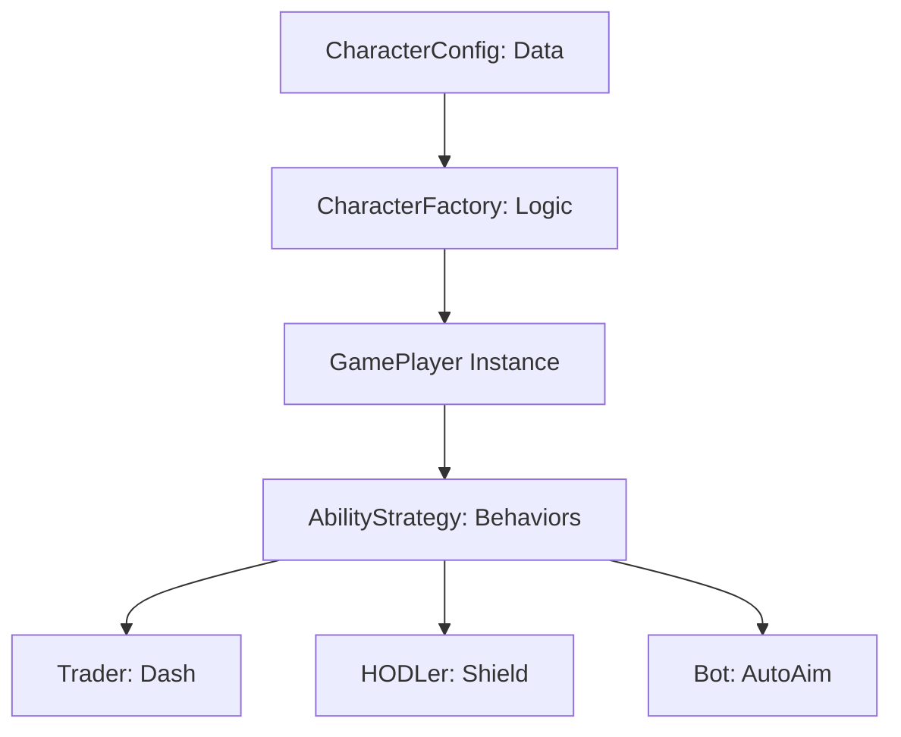

# :Smartphone: Player Character System

> **Status**: In Production / Expansion | **Type**: Character RPG Mechanics | **Domain**: Gameplay Framework

## :FileText: System Summary
The Crypto Survivors character system is a **Config-Driven + Factory Pattern** architecture based on various crypto community archetypes (Trader, Whale, HODLer, etc.). Each character has unique starting stats, special abilities, and specific unlock conditions.

## :Rocket: Key Features
- **Class-Based Archetypes**: 6 core character classes (Trader, Whale, Day Trader, HODLer, Degen, Bot).
- :Zap: **Special Abilities**: Unique active or passive abilities tailored to each character's strategy (Dash, Shockwave, Diamond Shield, etc.).
- :Trophy: **Progression & Unlocks**: Achievement-based character unlock system (e.g., "Whale" unlocked after 50,000 score).

## :Monitor: Architecture

## :Trophy: Character Directory
| Class | Theme | Strategy | Key Stat |
| :--- | :--- | :--- | :--- |
| **Trader** | Balanced | Versatile | Balanced Start |
| **Whale** | Tank | High HP, Heavy Damage | +50% HP, +30% Area |
| **Day Trader** | Glass Cannon | Speed & Attack Speed | +20% Speed, -40% HP |
| **HODLer** | Defensive | Armor & Regeneration | +5 Armor, Diamond Shield |
| **Degen** | Risk/Reward | Crit Strike Focused | +25% Crit, Volatility |

## :Settings: Technical Context
- **Factory Pattern**: Character data is dynamically generated via `CharacterFactory.ts`.
- **Strategy Pattern**: Abilities are abstracted with the `AbilityStrategy` interface and swapped at runtime based on character type.
- **Persistence**: Unlocks are stored locally in `localStorage` and synced with the Supabase `player_unlocks` table.

## :Zap: Performance & Security Level
- **Performance**: Character data is generated once outside the game loop; during gameplay, only `AbilityStrategy.execute` is called.
- **Security**: Character stats and cooldowns are verified on the server-side via `verify-game` to prevent "infinite ability" or "god mode" cheats.

---
// END OF PROTOCOL
