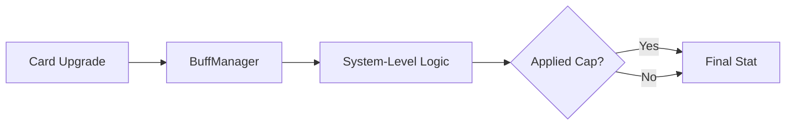

# :Bolt: Stat System Architecture

> **Status**: Production Ready | **Type**: Configuration & Logic | **Domain**: Character RPG Mechanics

## :FileText: System Summary
The Crypto Survivors stat system is designed to protect player progression against infinite power creep and maintain game balance. The system utilizes "Hard Cap" (absolute upper limit) and "Diminishing Returns" mechanisms to ensure that card upgrades remain meaningful at every stage.

## :Rocket: Key Features
- **Centralized Stat Capping**: All limits are centrally defined in `PlayerConfig.ts`.
- :Check: **System-Level Enforcement**: Limits are applied at the system level (`CombatSystem`, `CollisionSystem`, etc.) rather than the card level.
- :Bolt: **Formula-Based Balancing**: Stats like Armor use formula-based (diminishing returns) scaling instead of linear scaling.

## :Monitor: Architecture

## :Trophy: Stat Caps
| Stat | Cap | Description |
| :--- | :--- | :--- |
| **Fire Rate** | 50ms | Fire rate is limited to a maximum of 20 shots per second. |
| **Crit Chance** | 95% | Critical hit chance never reaches 100% (5% miss margin). |
| **Armor** | 15 Pts | Non-linear protection providing up to 43% damage reduction. |
| **Luck** | 20 Pts | Increases rare item drop rates and crystal values. |
| **Projectiles** | 8 | Maximum number of projectiles from a single shot. |

## :Settings: Technical Context
- **Data Flow**: `Card Effect` -> `BuffManager` -> `System Logic` -> `Stat Cap`.
- **Armor Formula**: `armor / (armor + 10)` ensures each new armor point provides less additional damage reduction.
- **Luck Effects**: Luck affects not only critical hits but also the probability and value of crystal drops.

## :Zap: Performance & Security Level
- **Performance**: Stat calculations are "baked" beforehand and returned at O(1) speed via `getDecoratedStats`.
- **Security**: Hard cap values are replicated in the server-side `verify-game` function to prevent fraudulent stat increases.

---
// END OF PROTOCOL
