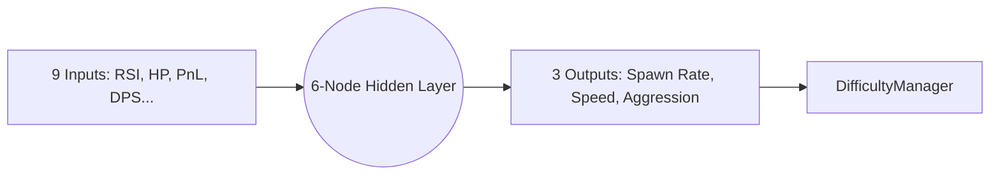

# :GenesisEmblem: Neural AI Director

> **Status**: Production Ready | **Type**: Neural Network Service | **Domain**: Adaptive Difficulty & AI

## :FileText: Logic Summary
The "Director" layer is an artificial intelligence brain that dynamically modulates game difficulty based on the player's stress level, performance, and current market conditions. Instead of a linear difficulty increase, it uses market volatility to create high-adrenaline moments and strategic pauses.

## :Rocket: Key Features
- **Neural Input Processing**: Concurrent processing of data from 9 different sensors (Market RSI, MACD, Player HP, PnL, etc.).
- :Check: **Dynamic Pacing**: Adjusts enemy density and aggression within milliseconds based on player performance.
- :GenesisEmblem: **Market-Driven Logic**: Specialized algorithms that transform real Bitcoin volatility into "in-game danger" factors.

## :Monitor: Internal Architecture

## :Settings: Technical Context
- **Engine**: Multilayer Perceptron (MLP) architecture based on `synaptic.js`.
- **Update Frequency**: Sensor data is "fed-forward" every 1000ms to generate new difficulty coefficients.
- **Data Normalization**: Inputs are normalized to the [0, 1] range before being sent to the neural network.

## :Zap: Performance & Security Level
- **Performance**: Low-cost matrix calculations requiring no memory allocation.
- **Security**: AI brain weights are generated in the server-side "Darwin" training pipeline, and only the ready model (JSON) is sent to the client.

---
// END OF PROTOCOL
