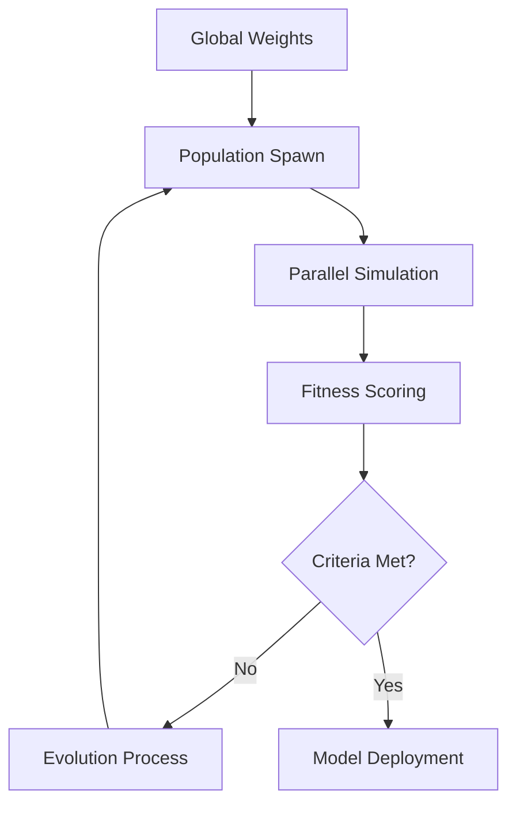

# :Cpu: AI Training Workflow (Project Darwin)

> **Status**: active | **Type**: Neural Network Training Pipeline | **Domain**: Autonomous Balancing

## :FileText: System Summary
"Project Darwin" is an evolutionary algorithm pipeline used to train the neural network-based AIDirector model for Crypto Survivors. This system automatically determines the most balanced and engaging difficulty coefficients by running thousands of parallel simulations.

## :Rocket: Training Workflow
1. **Simulation Phase**: Dedicated workers run the game engine in headless mode at 100x speed.
2. **Fitness Evaluation**: Scoring agents based on survival time, player stress markers, and "fun density".
3. **Crossover & Mutation**: The best performing neural weights are merged and mutated for the next generation.
4. **Export**: The final weights are exported as `brain_weights.json` for client-side execution.

## :Monitor: Training Architecture

## :Settings: Technical Context
- **Engine**: Node.js cluster-based simulation.
- **Library**: `synaptic.js` for network topology.
- **Iteration**: 100 generations per training cycle.

## :Zap: Performance & Security Level
- **Performance**: High-concurrency worker threads.
- **Security**: Weights are signed with a private key to prevent unauthorized brain modifications.

---
// END OF PROTOCOL
