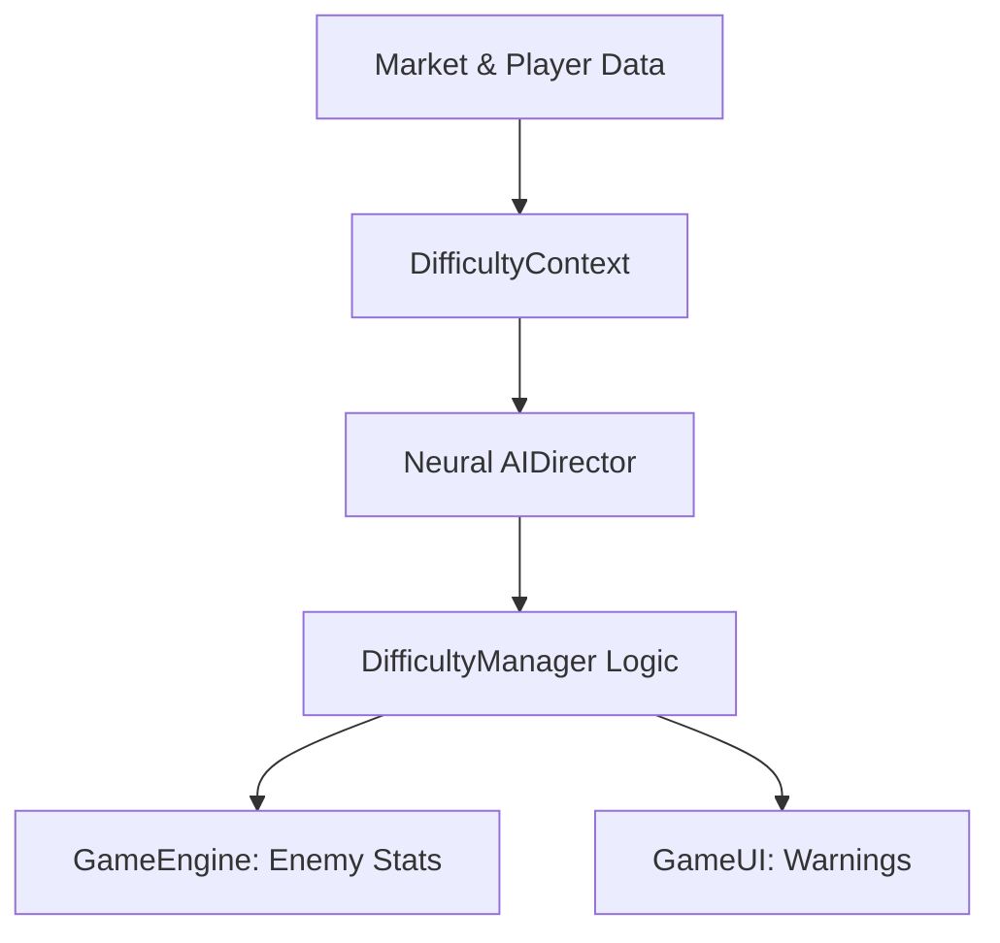

# :Target: Difficulty Manager (V2 Architecture)

> **Status**: Production Ready | **Type**: Orchestrator Service | **Domain**: Game Balance & Mapping

## :FileText: Logic Summary
`DifficultyManager` is an orchestrator service that manages the game's difficulty parameters by combining market data and in-game metrics. This service transforms neural decisions from the "Director" layer into concrete coefficients (HP, Speed, Spawn Rate) that the game engine can understand.

## :Rocket: Key Features
- **Layered Difficulty V2**: Modular architecture consisting of Data Collection (Inputs), Analysis (Context), Decision (Director), and Implementation (Output) layers.
- :Zap: **Leverage-Based Scaling**: Logarithmic difficulty and reward scaling based on the player's risk appetite (Leverage ratio).
- :Alert: **Volatility Shock Engine**: Trigger system that translates sudden market fluctuations into visual screen shakes and intense enemy waves.

## :Monitor: Internal Architecture

## :Settings: Technical Context
- **Singleton**: `DifficultyManager.getInstance()`
- **Output Mapping**: Maps neural coefficients (between 0.5 and 2.0) to specialized HP and speed multipliers for each enemy type.
- **Liquidation Warnings**: Broadcasts "Liquidation Risk" alerts via `EventBus` to the UI layer when player HP falls to critical levels.

## :Zap: Performance & Security Level
- **Performance**: Mathematical calculations are performed over cached values to minimize per-frame overhead.
- **Security**: Difficulty coefficients are cross-checked with session duration and market data in the server-side `verify-game` function to prevent fraudulent "easy mode" attempts.

---
// END OF PROTOCOL
