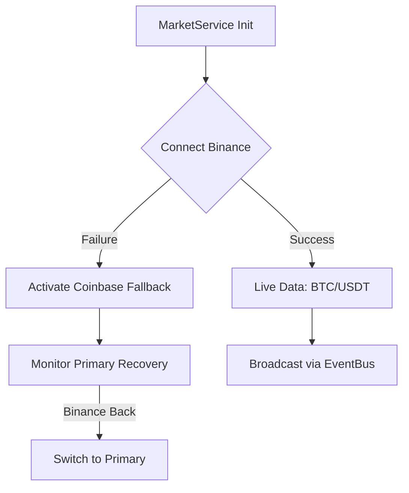

# :MarketChart: Market Engine (Real-time Price Service)

> **Status**: Production Ready | **Type**: Singleton Service | **Domain**: Market Data & Connectivity

## :FileText: Engine Summary
`MarketService` is a high-performance WebSocket client providing real-time Bitcoin (BTC) data to feed the game's core "price-driven difficulty" system. It processes incoming data from Binance and Coinbase, distributing synchronized price and volume information across the entire system.

## :Rocket: Key Features
- **Dual-Source Redundancy**: Uninterrupted data flow via Binance (Primary) and Coinbase (Fallback).
- :Check: **Intelligent Connectivity**: Smart connection management with exponential backoff and Visibility API integration.
- :Check: **Zero-Downtime Data Flow**: Sustains gameplay continuity during WebSocket disconnects using the last known healthy price (stale-price).

## :Monitor: Internal Architecture

## :Settings: Technical Context
- **Singleton**: Global access via `MarketService.getInstance()`.
- **EventBus**: Broadcasts price changes to the entire system every millisecond using the `priceUpdated` event.
- **Visibility Sync**: Puts the connection into sleep mode when the browser tab is hidden to prevent unnecessary traffic.

## :Zap: Performance & Security Level
- **Performance**: Low-latency data processing and buffer management.
- **Security**: "Sanity checks" filter out abnormal price fluctuations (fat-finger errors or manipulation).

---
// END OF PROTOCOL
