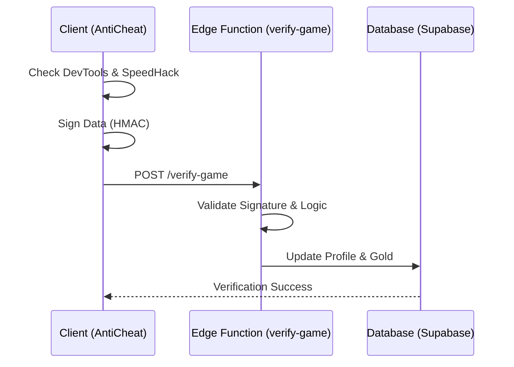

# :Shield: Security & Anti-Cheat Infrastructure

> **Status**: Production Ready | **Type**: Multi-Layer Protection | **Domain**: Security/Integrity

## :FileText: Security Summary
Crypto Survivors features a multi-layered security infrastructure operating on both client and server sides to ensure a fair competitive environment. This system provides protection against a wide range of threats, from memory manipulation to network forgery.

## :Rocket: Key Features
- **Multi-Layered Protection**: Client-side (DevTools, Debugger, SpeedHack) and Server-side (verify-game) verification.
- :Check: **HMAC Data Signing**: Game session data is signed with secret keys before being sent to the server.
- :Shield: **Memory Integrity Checks**: Monitoring critical in-game values (score, coin, HP) using checksum methods.

## :Monitor: Security Architecture

## :Settings: Technical Context
- **Client Service**: `AntiCheatService.ts` (Auto-initialized when the game starts)
- **Server Guard**: Supabase Edge Function (`verify-game`)
- **EventBus**: Reports via the Logger when a `cheatDetected` event is triggered.

## :Zap: Performance & Security Level
- **Performance**: Detection loops (between 100ms - 5000ms) are optimized not to impact browser performance.
- **Security**: Protected against brute-force attacks via Cloudflare Turnstile and IP-based throttling.

---
// END OF PROTOCOL
