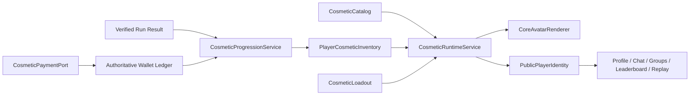

# Cosmetic Identity System Design

> **Status**: approved product design; implementation plan pending review
> **Date**: 2026-07-14
> **Domain**: player cosmetics, collection progression, social identity, economy sinks

## Summary

Crypto Survivors will treat cosmetics as a persistent player identity system,
not as isolated skin files. A player equips a circular **Market Core** skin,
trail, aura, banner, frame, and title. The same resolved identity is reused in
gameplay, results, leaderboards, replay, profiles, chat, communities, and groups.

Cosmetics never grant gameplay power. Owned skins gain mastery through
server-verified play, while coins are spent to activate unlocked visual levels.
Duplicates convert into Style Shards for alternate cosmetic variants. This
creates a durable coin sink without making combat pay-to-win.

The rendering model extends the current Canvas2D player and `SkinService`
architecture. The avatar remains a non-humanoid, radial cyber core inspired by
the current circular player. Premium quality comes from controlled silhouette,
materials, animation, reactivity, and social presentation rather than larger
hitboxes or uncontrolled particle density.

## Product Goals

1. Give earned coins desirable, recurring, and visible uses.
2. Make cosmetic ownership and progression prestigious across every surface.
3. Support hundreds of visually consistent cosmetics without hundreds of custom
   gameplay implementations.
4. Preserve the current fixed player scale, market readability, and 60 FPS
   runtime constraints.
5. Keep ownership, progression, and spending authoritative and auditable on the
   server.
6. Remain compatible with a future chain-independent token payment boundary
   without designing blockchain internals now.

## Non-Goals

- Adding combat stats, passive bonuses, luck, damage, speed, or reward modifiers
  to cosmetics.
- Designing token issuance, custody, bridges, withdrawals, legal structure, or
  chain-specific contracts.
- Replacing the circular player with a humanoid, directional RPG character.
- Shipping raw AI-generated art directly into the game.
- Allowing rarity or upgrade level to obscure LONG/SHORT market communication.
- Making every cosmetic a bespoke renderer or loading the full catalog at run
  start.

## Approved Product Decisions

- The avatar is a radial **Market Core**, not a humanoid sprite.
- Cosmetics are modular: core skin, trail, aura, banner, frame, and title can be
  mixed independently.
- Matching items from one theme enable a purely visual **Theme Resonance**.
- Skin progression combines verified usage mastery with a coin activation cost.
- Failed runs still grant mastery; milestones such as cycles, bosses, streaks,
  and successful exits grant bonuses.
- Five authored visual levels are followed by infinite social prestige ranks.
- Duplicate drops convert into Style Shards instead of coins.
- Style Shards unlock palettes, materials, and prestige variants but cannot skip
  mastery requirements.
- Acquisition is mixed across gameplay drops, rotating stores, achievements,
  and events.
- Prestige is visible in gameplay, hub, results, leaderboard, replay, profile,
  chat, communities, and groups.
- All purchases, upgrades, ownership changes, and public identity projections
  are server authoritative.

## Player Experience

The core loop is:

```text
Acquire cosmetic
  -> Equip it
  -> Play verified runs
  -> Gain mastery
  -> Reach a visual-level threshold
  -> Spend coins to activate the level
  -> Unlock stronger presentation
  -> Continue into social prestige
```

The player should feel three distinct rewards:

1. **Ownership** gives an immediately usable base cosmetic.
2. **Mastery** proves the player used and developed that cosmetic.
3. **Activation** creates a meaningful coin-spend moment with a reveal animation,
   collection score increase, and updated social identity.

The store must present the next visible transformation, not only a price. Upgrade
previews show the current form beside the next form, the required mastery, the
coin cost, and where the unlocked presentation appears socially.

## Cosmetic Slots

The loadout is generic and independent from any one theme:

```ts
type CosmeticLoadout = {
  coreSkinId: string;
  trailId: string | null;
  auraId: string | null;
  bannerId: string | null;
  frameId: string | null;
  titleId: string | null;
};
```

| Slot | Gameplay | Social surfaces |
| --- | --- | --- |
| Core skin | Shell, core, material, reactive animation | Portrait centerpiece |
| Trail | Movement history and dash response | Small identity swatch or preview |
| Aura | Bounded ambient effect | Portrait background treatment |
| Banner | Not rendered in combat | Nameplate and profile header |
| Frame | Optional compact HUD treatment | Avatar/profile/chat frame |
| Title | Not rendered in combat | Name-adjacent prestige label |

Each definition declares its theme, rarity, supported levels, asset references,
render recipe, performance tier, and fallback. Content definitions contain no
ownership or wallet state.

## Visual Progression

Each core skin has five authored visual levels. The character does not become
physically larger as it levels.

| Level | Name | Presentation change |
| --- | --- | --- |
| 1 | Base Form | Theme shell, palette, core material |
| 2 | Charged Core | Center animation, pulse rhythm, controlled glow |
| 3 | Reactive Form | Movement or dash shell response and bounded particles |
| 4 | Orbital Form | Satellites, rings, or non-colliding protrusions |
| 5 | Awakened Form | Entrance, signature aura, portrait and nameplate motion |

After level 5, prestige ranks continue without adding unbounded gameplay VFX.
Prestige changes stars, badges, banner marks, portrait details, collection score,
and optional material variants. This preserves long-term aspiration while
protecting combat readability and performance.

## Mastery and Coin Sink

Mastery is earned only from server-verified run results. The versioned reward
function may consider verified active play time, completed market cycles, boss
and streak milestones, successful exits, and reduced but non-zero progress for
failed runs.

Reaching a mastery threshold unlocks permission to buy the next visual level. It
does not activate that level automatically. Activation spends coins through the
authoritative wallet ledger and records an idempotent upgrade transaction.

Costs are defined by versioned economy configuration rather than hardcoded in
services. They scale by rarity and level, with the largest price step reserved
for Awakened Form. Exact prices require telemetry from coin earning, wallet
distribution, store conversion, and progression time.

The sink has no random upgrade failure, stat advantage, hidden mid-request price
change, mastery bypass, duplicate-to-coin conversion, or client-authoritative
wallet mutation.

## Duplicates and Style Shards

When a player receives an already-owned cosmetic, the server converts it into a
rarity-weighted amount of Style Shards in the same idempotent acquisition
transaction.

Style Shards may unlock approved palettes, material treatments, prestige-only
variants, and matching social treatments. They may not unlock the next mastery
level, reduce coin activation cost, grant combat power, or convert back into
coins. Duplicates remain valuable while coins stay the primary progression sink.

## Theme Packs and Resonance

A theme pack is a catalog grouping, not an indivisible loadout. Players may mix
all cosmetic slots. Equipping a configured matching set activates Theme
Resonance, a bounded visual-only presentation such as a coordinated spawn pulse,
profile backdrop, banner shimmer, or result-screen flourish.

Theme Resonance never changes collision, damage, speed, drop rates, mastery, or
rewards. Its gameplay effect budget is lower than the Awakened core budget so the
combination cannot produce visual overload.

## Runtime Architecture



- `CosmeticCatalog` owns immutable definitions, theme metadata, rarity, visual
  levels, asset manifests, and fallback references.
- `PlayerCosmeticInventory` is server-authoritative ownership, mastery, activated
  level, prestige, variants, and Style Shards.
- `CosmeticLoadout` stores equipped slot identifiers and is validated against
  inventory.
- `CosmeticProgressionService` validates mastery, economy version, ownership,
  and coin balance before atomically applying upgrades.
- `CosmeticRuntimeService` extends the current `SkinService`: it resolves the
  equipped loadout outside the RAF loop into a stable preallocated snapshot.
- `CoreAvatarRenderer` draws ordered layers without knowing inventory, economy,
  or social rules.
- `PublicPlayerIdentity` is a safe server projection for every social surface.
- `CosmeticPaymentPort` is a chain-independent authoritative spend boundary; it
  exposes no blockchain concepts to catalog, progression, or rendering code.

The existing `SkinRegistry`, `SkinService`, and `cosmeticsStore` become migration
inputs rather than parallel long-term authorities. Existing palette skins remain
valid level-1 catalog entries during migration.

## Render Contract

`CoreAvatarRenderer` draws shadow, market signal, shell, core, orbitals, aura,
trail, and short-lived reactive particles in that order.

| Element | Contract |
| --- | --- |
| Collision radius | 9 px, unchanged |
| Core visual radius | 12 px / 24 px diameter |
| Fixed shell and protrusions | Maximum 18 px radius |
| Market signal ring | Approximately 22 px radius and never obscured |
| Glow, orbitals, brief particles | Maximum 28 px radius |
| Gameplay source frame | 64 x 64 px, centered |
| Authoring source | 128 x 128 px, downsampled and validated |

Profile and chat portraits use separate high-resolution assets instead of scaled
gameplay frames.

Runtime requirements remain non-negotiable:

- resolve only when catalog, inventory, settings, or equipment changes;
- load only equipped gameplay assets plus required fallbacks;
- allocate no objects or arrays in the RAF draw path;
- precompute colors, frames, layer flags, and reduced-effect variants;
- pool trail and reactive particles;
- use deterministic animation parameters from existing time inputs;
- reduce aura, particles, and secondary orbitals on lower quality settings
  without erasing primary silhouette or identity.

## Market Readability

The current LONG/SHORT signal remains visually dominant. Cosmetics may theme
supporting accents but cannot replace semantic market colors or cover the signal
ring. Every skin is reviewed in LONG and SHORT states, on representative maps,
at actual gameplay scale.

Signal direction retains shape, motion, and ring behavior so color-blind
accessibility is not dependent on a cosmetic palette.

## Social Identity

```ts
type PublicPlayerIdentity = {
  playerId: string;
  displayName: string;
  coreSkinId: string;
  coreSkinLevel: number;
  prestigeRank: number;
  variantId: string | null;
  bannerId: string | null;
  frameId: string | null;
  titleId: string | null;
  themeResonanceId: string | null;
  identityVersion: number;
};
```

Profiles, chat messages, group rosters, community pages, leaderboards, results,
and replay metadata consume this server projection. They never trust cosmetic
IDs sent with an ordinary client message. `identityVersion` invalidates caches
after equipment or progression changes.

Animated chat banners and frames pause or reduce motion outside the visible
viewport and follow reduced-motion settings. Message content always remains more
readable than decoration.

## Server Data Model

| Record | Purpose |
| --- | --- |
| Cosmetic catalog version | Active content and economy compatibility |
| Player cosmetic item | Ownership, mastery, active level, prestige, variant |
| Player cosmetic loadout | Equipped slot identifiers and revision |
| Style Shard balance/ledger | Duplicate conversion and shard spending audit |
| Cosmetic transaction | Idempotent acquire, upgrade, variant, and equip audit |
| Public identity projection | Fast social reads and cache versioning |

Catalog definitions may ship with the client for rendering, but the server is
authoritative for active catalog version, purchasability, costs, requirements,
ownership, and progression.

An upgrade command includes an idempotency key, cosmetic ID, target level, and
expected economy version. In one database transaction the server locks inventory
and wallet state, verifies ownership and the exact next level, validates mastery
and economy version, records the coin spend, increments the level, refreshes the
public identity when equipped, and stores the transaction result. Retries return
the original result and never charge twice.

## Acquisition

The catalog supports gameplay drops and fragments, rotating coin offers,
achievements and collection milestones, and time-bounded event or community
rewards. Every acquisition resolves server-side to either new ownership or
duplicate Style Shards. Event expiration never removes owned cosmetics.

## Art Production Pipeline

The core pipeline is 2D and does not require Meshy or another 3D asset service:

```text
Brief and Cosmetic Art Bible
  -> concept sketches or AI-assisted ideation
  -> human selection and redraw
  -> layered 2D cleanup
  -> gameplay PNG/WebP and optional atlas
  -> portrait/banner assets
  -> automated validation
  -> gameplay-scale contact sheet
  -> human art and performance review
  -> catalog release
```

AI may accelerate ideation, variations, or mood exploration. AI output is never
shipped directly. Artists rebuild geometry, materials, symbols, lighting, and
animation layers to match the game's visual rules and remove generation
artifacts.

| Rarity | Primary implementation |
| --- | --- |
| Common | Canvas recipe, approved palette, simple shell variant |
| Rare | Richer modular recipe, material accents, controlled secondary motion |
| Epic | Custom shell sprite, authored reactive layers, bespoke particles |
| Legendary | Animated 2D atlas, signature Awakened sequence, premium portrait |

Code provides shared rotation, pulse, squash/stretch, orbital motion, aura, and
trail systems. Content authors configure these primitives instead of recreating
movement logic for every skin.

## Cosmetic Art Bible

The versioned Art Bible defines radial shape language, silhouette families,
core-to-shell ratios, pivots, palettes, market-signal exclusions, materials,
strokes, bloom, particles, rarity animation budgets, and social compositions. It
also forbids AI artifacts, pseudo-text, inconsistent lighting, nonsense symbols,
and noisy micro-detail.

Premium feel comes from coherent direction, material response, silhouette,
animation timing, and reactivity. More particles, glow, or size are not
substitutes for quality.

Every release batch is reviewed as a contact sheet at actual gameplay size.
Reviewers compare rarities and levels to confirm a premium step without making
lower tiers feel broken. Each asset records an `artVersion` for controlled future
reprocessing.

## Asset Validation

Automated checks reject invalid frame dimensions, pivots, alpha bounds, required
layers, atlas frames, catalog references, texture budgets, frame counts, semantic
LONG/SHORT color collisions, unsupported blend modes, and missing fallbacks.

Visual regression generates contact sheets for every skin level in idle,
movement, reactive, LONG, SHORT, reduced-effects, and representative map states.
Human approval remains mandatory because automation cannot judge coherence or
premium feel.

## Failure Handling

- Equipping an unowned item is rejected by the server.
- A stale loadout revision returns the authoritative loadout.
- Invalid mastery, balance, target level, or economy version causes no partial
  mutation.
- Missing core assets fall back to the default Market Core.
- Missing optional assets disable only their own layer.
- A newer unknown social identity catalog version renders a stable default.
- Acquisition and upgrade commands are idempotent.

## Security and Trust Boundaries

- The client is never authoritative for ownership, mastery, activated level,
  Style Shards, price, or coin balance.
- Mastery derives from the existing server-verified session result path.
- Cosmetic commands are authenticated and rate limited.
- Responses return wallet and inventory revisions for reconciliation.
- Social identity comes from server inventory and loadout records.
- Catalog and economy versions are attached to commands and telemetry.

## Testing Strategy

Coverage includes catalog and fallback validity, ownership validation, fixed
collision and visual envelopes, LONG/SHORT readability, mastery calculation,
failed-run progress, upgrade rejection paths, duplicate conversion, idempotency,
identity refresh, asset fallbacks, RAF allocation budgets, particle limits, and
reduced-effects behavior.

E2E coverage verifies that a fixture cosmetic can be acquired, equipped, mastered
through a verified run, upgraded, and displayed consistently in gameplay,
results, profile, and chat fixtures.

## Telemetry and Economy Controls

Required metrics include coin earn/hold/spend distribution, store conversion,
mastery time, eligibility-to-purchase delay, duplicate and shard balance,
equipped diversity, theme completion, device performance, and social identity
interactions.

Economy changes are versioned and forward-only. Completed transactions never
change. Telemetry distinguishes coin spending from a future external payment
rail without adding chain logic to cosmetic progression.

## Delivery Phases

1. **Foundation**: catalog, migrated skins, loadout, runtime snapshot, layered
   renderer, and asset validator.
2. **Authoritative inventory**: backend ownership, equip, public identity, and
   local cosmetic migration.
3. **Progression sink**: verified mastery, coin activation, idempotent upgrades,
   Style Shards, and telemetry.
4. **Social identity**: profile, leaderboard, results, replay, then chat,
   communities, and groups.
5. **Content pipeline**: Art Bible, contact sheets, rarity templates, themes, and
   controlled rotating store.
6. **Payment compatibility**: add `CosmeticPaymentPort` adapters only after a
   separate token and custody design is approved.

Each phase ships behind capability and catalog-version checks. The client keeps
rendering the default Market Core when later services are unavailable.

## Acceptance Criteria

- Existing skins migrate without collision or market-readability changes.
- Slots from different themes can be mixed.
- A verified run adds equipped-core mastery exactly once.
- An eligible upgrade atomically spends coins and activates one next level.
- Cosmetics provide no gameplay stats.
- Duplicates grant Style Shards and never coins.
- One authoritative identity appears across gameplay and social surfaces.
- Missing optional assets degrade by layer and missing cores fall back safely.
- The steady-state player render path adds no per-frame allocations.
- Every asset passes automated, visual, human, and device review.

## Open Implementation Questions

- Exact mastery thresholds and coin prices by rarity and level.
- Initial launch catalog size and theme count.
- Whether matching theme items receive partial shared mastery.
- Backend projection transport for future real-time chat.
- Exact low-end particle, atlas-memory, and social-animation budgets.
- Final adapter contract for future off-chain and on-chain payment sources.

## Related Architecture

- [Current skin system](/docs/architecture/SKIN_SYSTEM)
- [Railway-native platform](/docs/architecture/RAILWAY_NATIVE_PLATFORM)
- [Market Cache lootbox design](/docs/superpowers/specs/2026-07-13-market-cache-lootbox-design)
