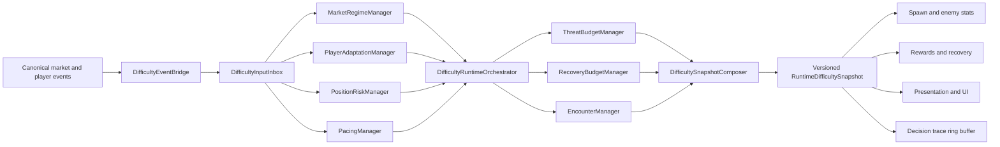

# Modular Difficulty Runtime Design

> **Status:** approved design
> **Owner:** Core Gameplay
> **Created:** 2026-07-15
> **Execution profile:** `/ultrathink`

## Goal

Replace the incomplete split between the legacy `DifficultyManager` / `UnifiedDirector` path and the active `ExperienceDirector` spawn path with one modular difficulty runtime.

The runtime must combine market indicators, position risk, player adaptation, pacing, encounters, enemy pressure, recovery, rewards, and presentation into one versioned `RuntimeDifficultySnapshot`. It must remain easy to debug, deterministic, allocation-conscious, and safe at 60 FPS.

"One authority" means one committed gameplay snapshot. It does not mean one class owns every calculation. A thin orchestrator composes independently testable domain managers through explicit contracts.

## Current-State Diagnosis

The repository is in a partial migration state:

- `DifficultyPhase` only advances `DifficultyContext` time and does not produce a runtime difficulty decision.
- `DifficultyManager.calculate()` and `UnifiedDirector` are covered by direct and golden tests but are not called by the active game runtime.
- `useDifficultyV2()` returns constant neutral values, so UI consumers cannot observe the active director decision.
- `DirectorSpawnOrchestrator` and `ExperienceDirector` actively control spawn plans, but player telemetry is incomplete: damage intake is fixed at zero, kill streak is passed as kills per minute, and mobility is sampled as a frame boolean.
- The present `GameplaySnapshot` is not comparison-only: `GameEngine` passes it to both `SpawnPlanBuilder` and `PresentationDirector` before the phase loop. `DifficultyPhase` therefore cannot become the authority until that direct pre-phase evaluation is extracted behind the `current` adapter.
- `FlowStateManager`, `PlayerPowerAnalyzer`, and `PlayerMetricsAggregator` contain useful player-adaptation logic, but their outputs do not drive the active director authority.
- `MarketEventConsolidator` and `MarketRegimeEngine` provide a canonical market path, but several presentation and gameplay systems still consume raw market fields or independent market services.
- Spawn, enemy stats, rewards, presentation, and legacy difficulty outputs do not share one committed decision revision.

This explains why individual systems appear functional in isolation while the complete game flow feels disconnected.

## Design Principles

1. **One committed authority:** all gameplay consumers use one `RuntimeDifficultySnapshot` revision.
2. **Modular managers:** each domain manager owns one calculation and can run independently with explicit input.
3. **Thin orchestration:** the orchestrator orders and combines outputs but does not duplicate domain calculations.
4. **Event-driven inputs:** market and player events update an inbox; they do not mutate gameplay directly.
5. **Tick-boundary commits:** decisions become visible only at a deterministic simulation boundary.
6. **DRY contracts:** normalization, quality, reason codes, revision metadata, and clamps use shared types and helpers.
7. **No hidden reads:** pure managers do not read EventBus, React, stores, wall-clock time, or gameplay singletons.
8. **Debug by revision:** every final effect can be traced to its source inputs and manager decisions.
9. **Safety before pressure:** recovery and player safety cap market-driven pressure.
10. **Graceful degradation:** missing or stale data produces bounded neutral behavior, never punitive spikes.

## Scope

### Included

- Modular difficulty runtime contracts.
- Event bridge and pre-allocated input inbox.
- Market, player, position-risk, pacing, budget, and encounter domain managers.
- Thin orchestrator and final snapshot composer.
- Snapshot consumption by spawn, enemy stats, rewards, presentation, and difficulty UI.
- Decision traces and a fixed-capacity debug ring buffer.
- Shadow comparison, replay, integration, performance, and lifecycle tests.
- Compatibility adapters for existing events and temporary legacy consumers.
- Independent rollout and rollback control.

### Excluded

- Exact final gameplay tuning values; weights and thresholds remain configuration work validated through simulation.
- Backend schema changes.
- Replacing the canonical market runtime or SSE transport.
- Letting presentation-only market systems modify gameplay authority.
- Removing legacy golden fixtures before modular parity and deliberate-drift decisions are recorded.

## Assumptions

- `marketRuntimeSnapshot` remains the preferred live market compute result.
- `MarketEventConsolidator` continues to produce ordered `CanonicalMarketFrame` values.
- Run constants such as entry price, position, leverage, and liquidation price are locked at run start.
- `DifficultyPhase` remains the deterministic simulation boundary for committing decisions. It receives the tick from `TickContext.clock.frame` and elapsed simulation seconds from `TickContext.clock.elapsedMs`.
- Simulation time in elapsed seconds is the only duration and encounter-timing unit. Frame ticks identify commit boundaries and `validFromTick` only; they are never added to seconds, market sequences, or wall-clock timestamps.
- Existing director configuration is the source for cadence, limits, and weights until explicitly versioned replacements are approved.
- Game consumers can migrate incrementally through compatibility adapters while shadow mode is active.

## Invariants

The implementation must preserve these invariants:

1. A gameplay tick observes at most one committed difficulty revision.
2. A committed snapshot contains outputs derived from one coherent set of input revisions.
3. No consumer combines a new market revision with an older player revision outside the orchestrator.
4. Every numeric snapshot field is finite and within its declared range.
5. Market staleness cannot increase gameplay pressure.
6. Missing player telemetry cannot produce a punitive adjustment.
7. Mercy and recovery caps are applied after pressure requests and before final output mapping.
8. The same run seed, event sequence, configuration version, and simulation clock produce the same snapshots and traces.
9. Game reset, game over, cycle continuation, and runtime disposal cannot leak manager state into a later run.
10. No EventBus handler directly spawns enemies, changes enemy stats, grants rewards, or modifies final difficulty.
11. Spawn, enemy stats, rewards, and presentation consume the same snapshot revision.
12. The hot path does not allocate unbounded arrays or update React state per frame.

## Architecture



### Public Authority

`DifficultyRuntimeOrchestrator` is the sole modular coordinator and final snapshot commit owner. It coordinates manager execution and snapshot commit policy without performing market normalization, player telemetry aggregation, pacing calculations, or consumer-output mapping inline.

`ExperienceDirector` and `DirectorSpawnOrchestrator` remain only behind the `current` rollout adapter while shadow comparison is required. Their reusable allocator and planner responsibilities move into explicit domain managers. They do not wrap or remain alongside the modular orchestrator after cutover.

The first runtime migration extracts the current direct `GameEngine` call into a `CurrentDifficultyRuntimeAdapter` selected by the same runtime plan. `DifficultyPhase` then invokes either that adapter, the modular orchestrator, or both for shadow comparison. The existing pre-phase `DirectorSpawnOrchestrator.update()` call is removed; `GameEngine` does not retain a parallel director evaluation path.

`DifficultyPhase` publishes one internal `DifficultyPhaseDecision` union to shared state. Every mode supplies one active `SpawnPlan` and revision to `SpawnPhase`; `current` supplies the current-adapter plan, `shadow` supplies that same current-adapter plan plus a non-authoritative modular comparison snapshot, and `modular` supplies a plan expanded from the committed `RuntimeDifficultySnapshot`. This phase-only union is not a public snapshot contract and cannot be consumed to reconstruct raw difficulty inputs.

### Input Boundary

`DifficultyEventBridge` is the only EventBus-aware adapter in the difficulty runtime. It subscribes to approved source events and writes normalized event data into `DifficultyInputInbox`.

Approved input categories include:

- canonical market frames and feed quality;
- run lifecycle and locked position constants;
- enemy kills and damage dealt;
- player hits and near-death duration;
- dash and movement activity;
- attacks and weapon progression;
- level-up and build-power changes;
- world pressure such as active and maximum enemies.

Event handlers only update pre-allocated counters, rolling windows, last-known values, and dirty flags. They do not invoke the director or gameplay consumers.

Canonical market frames are copied by value into the inbox at the simulation lock boundary. The bridge retains the upstream source sequence separately from the consolidator's local arrival sequence, ignores out-of-order source sequences, and uses `TickContext.clock` simulation time for all decision eligibility and staleness checks. `Date.now()`, reused mutable frame references, and RAF timestamps do not enter manager inputs.

### Input Inbox Contract

`DifficultyInputInbox` owns the only mutable pre-commit representation of runtime inputs. It maintains a fixed input-revision vector `{ market, player, run, world }` and exposes a read-only coherent input view only to the orchestrator. An accepted update changes its domain revision once when the next simulation boundary drains the inbox; multiple same-tick updates coalesce before revision assignment.

| Source | Accepted payload | Coalescing and dedupe | Visibility and dirty rule |
| --- | --- | --- | --- |
| `canonicalMarketFrame` | Complete `CanonicalMarketFrame`, including `sequence`, `revision`, and `quality` | Ignore a sequence less than or equal to the accepted sequence; retain only the greatest accepted sequence per boundary | Marks market dirty; a frame received after `DifficultyPhase` is eligible at the next boundary |
| `difficultyRunInitialized` | `runId`, `seed`, side, leverage, entry price, liquidation price, and initial tick | Ignore duplicate `runId` with identical locked constants; reject a changed constant for an active run | Marks run, position, and player domains dirty; establishes immutable run constants |
| `enemyKilled`, `enemyDamaged`, `playerHit`, `playerHealthChange`, `playerDash`, `bulletFired`, `levelUpComplete` | Existing typed event payload plus bridge-assigned eligible tick | Accumulate named counters and rolling windows in configuration-owned buckets; event arrival order never changes a bucket total | Marks player dirty when the associated configured bucket or threshold changes |
| `gameOver`, `gameReset`, cycle-continuation event, and runtime disposal | Existing lifecycle payload and bridge-assigned eligible tick | Lifecycle actions supersede ordinary telemetry at the same boundary | Marks the lifecycle action dirty; reset order follows the lifecycle policy |
| `DifficultyPhase.recordWorldPressure` | Current tick, active enemies, maximum enemies, and active encounter counts from `TickContext` | One mutable world sample per boundary | Marks world dirty only when the bounded sample changes |

The bridge receives an explicit simulation-tick provider; it never reads wall-clock time. Events emitted after the `DifficultyPhase` boundary receive `eligibleFromTick = currentTick + 1`. Rolling-window duration, accepted value range, and dirty thresholds are versioned configuration keys, not service literals. The bridge rejects non-finite values before updating the inbox and records a reason code without making the player domain punitive.

### Domain Managers

#### MarketRegimeManager

Owns market classification and market event transitions. It consumes only `CanonicalMarketFrame` and configuration. The existing `MarketRegimeEngine` is the starting implementation.

Outputs include regime, confidence, pressure, volatility, volume, trend, RSI extremity, whale pressure, active event family, quality, and reason codes. Legacy market telegraph values are not reused for runtime timing; `EncounterManager` starts its duration from the orchestrator's elapsed simulation seconds when it observes a classified event transition. Market sequences and frame ticks are never used as encounter-duration arithmetic.

#### PlayerAdaptationManager

Owns player flow, stress, mastery, build power, damage pressure, kill rate, mobility usage, screen pressure, and recovery need.

It consolidates the useful responsibilities currently split across `FlowStateManager`, `IntensityModel`, `PlayerPowerAnalyzer`, and player metric accumulators. `IntensityModel` is the starting pre-allocated pure submodel. `FlowStateManager` must be adapted behind explicit inputs because its current EventBus, wall-clock, and array behavior is not valid in a pure manager. These submodels must not maintain competing gameplay authority.

Outputs include flow state, engagement, frustration, combat mastery, build power, recent damage pressure, kills per minute, mobility usage, recovery need, and challenge adjustment.

#### PositionRiskManager

Owns position alignment, leverage pressure, PnL direction, headwind, advantage, and liquidation proximity. The existing `PositionRiskModel` is the starting implementation.

Run constants are provided explicitly and remain immutable for the run.

#### PacingManager

Owns survival progression and build-up, peak, fade, recovery, and doom phase boundaries. Pacing is based on simulation time, not wall-clock time.

`SurvivalCurve` is the starting progression model for pacing. `PacingStateMachine` may provide only its market-event queue behavior; it is not the source of survival phases. The pacing envelope defines the minimum and maximum pressure allowed for the current phase. It does not read market or player state directly.

#### ThreatBudgetManager

Owns requested pressure, credit generation, maximum threat, and spendable threat. The existing `ThreatBudgetAllocator` is the starting implementation.

It consumes normalized domain outputs and cannot bypass pacing or safety caps. The orchestrator reserves threat credits through this manager before composing a spawn decision; `SpawnPlanBuilder` and `SpawnExecutor` never independently read or spend threat credits.

#### RecoveryBudgetManager

Owns mercy, recovery assistance, advantage credits, and non-punitive relief. The existing `AdvantageAllocator` is a starting component, expanded to consume explicit recovery need and safety caps.

#### EncounterManager

Owns encounter selection, telegraph, active, recovery, and cooldown phases. The existing `EncounterPlanner` is the starting implementation.

It consumes final bounded budgets and domain classifications. It does not read raw market indicators or player entities. Encounter stat modifiers are folded into the same reserved `SpawnDecisionSummary` that controls enemy multipliers, so a selected encounter cannot be presentation-only or silently bypass spawn execution.

### Snapshot Composer

`DifficultySnapshotComposer` maps approved manager outputs to the public `RuntimeDifficultySnapshot`. It is the only place where domain decisions become consumer-facing gameplay multipliers and plans.

This prevents repeated mapping logic in `GameEngine`, `SpawnSystem`, reward code, hooks, and HUD components.

## Canonical Snapshot and Runtime Mode

`types/runtimeDifficulty.ts` is evolved in place. Its minimal `RuntimeDifficultySnapshot` becomes the one expanded public difficulty contract; implementation must not introduce a second public snapshot type.

`GameplaySnapshot` in `services/director/contracts.ts` is active today. Phase 1 first extracts its present spawn and presentation use behind `CurrentDifficultyRuntimeAdapter`; it then becomes the internal `CurrentDirectorSnapshot` comparison type during shadow mode and is removed when the compatibility path is retired.

`config/directorRuntime.ts`, `DirectorRuntimeMode`, and `DirectorRuntimePlan` are evolved to resolve `VITE_DIFFICULTY_RUNTIME_MODE=current|shadow|modular`. This setting is independent from `VITE_MARKET_RUNTIME_MODE`, but it must reuse this existing mode resolver and must not introduce a second director-mode resolver or parallel mode-state model.

`VITE_DIFFICULTY_RUNTIME_MODE` is the only selector of difficulty authority. Missing or invalid values resolve to `current` and record one configuration warning; `VITE_MARKET_RUNTIME_MODE` never chooses a difficulty mode. The existing resolver maps the parsed external mode to one plan with `runsCurrentAdapter`, `runsModularShadow`, and `appliesModularSnapshot` flags. The old market-mode-derived mapping and its `LEGACY` / `NEW_AUTHORITY` authority meanings are removed in the same migration task.

## Manager Contract

All domain managers use a shared result envelope:

```typescript
type DecisionQuality = 'LIVE' | 'DEGRADED' | 'NEUTRAL';

type DomainDecision<TValue, TReason extends string> = {
  revision: number;
  validFromTick: number;
  inputRevision: number;
  quality: DecisionQuality;
  value: TValue;
  reasonCodes: readonly TReason[];
  clampCodes: readonly string[];
};
```

The exact implementation may use pre-allocated mutable objects internally for performance. Objects exposed beyond the commit boundary are read-only for consumers.

Each manager must support:

- explicit construction with configuration and dependencies;
- `update(input)` using deterministic inputs;
- `getSnapshot()` returning the latest decision;
- `reset()` returning to a documented neutral state;
- independent unit execution without EventBus or `GameEngine`.

## Difficulty Snapshot Contract

```typescript
type ReadonlyDeep<TValue> = TValue extends (...args: never[]) => unknown
  ? TValue
  : TValue extends readonly (infer TItem)[]
    ? readonly ReadonlyDeep<TItem>[]
    : TValue extends object
      ? { readonly [TKey in keyof TValue]: ReadonlyDeep<TValue[TKey]> }
      : TValue;

type RuntimeDifficultySnapshot = ReadonlyDeep<{
  meta: {
    revision: number;
    validFromTick: number;
    inputRevision: number;
    decisionId: string;
    algoVersion: string;
    configVersion: string;
    quality: DecisionQuality;
  };
  signals: {
    market: MarketDecisionSummary;
    player: PlayerDecisionSummary;
    position: PositionRiskSummary;
    pacing: PacingDecisionSummary;
  };
  pressure: {
    total: number;
    band: 'RELIEF' | 'LOW' | 'NORMAL' | 'HIGH' | 'CRITICAL';
    threatTarget: number;
    creditRate: number;
    availableCredits: number;
    maximumCredits: number;
    spawnCadence: number;
    maximumActiveEnemies: number;
  };
  spawn: SpawnDecisionSummary;
  enemy: {
    healthMultiplier: number;
    damageMultiplier: number;
    speedMultiplier: number;
    varietyMultiplier: number;
    behaviorTier: number;
  };
  recovery: {
    mercy: number;
    recoveryNeed: number;
    advantageCreditRate: number;
    availableAdvantageCredits: number;
    activeMechanic: string | null;
  };
  rewards: {
    xpMultiplier: number;
    gemDropMultiplier: number;
    lootOpportunityMultiplier: number;
  };
  encounter: EncounterDecisionSummary;
  presentation: {
    intensity: number;
    suggestedBpm: number;
    shakeLimit: number;
    audioIntensity: number;
  };
  trace: DifficultyDecisionTrace;
}>;
```

The same module defines every nested summary used above:

```typescript
type UnitInterval = number; // inclusive [0, 1]
type DifficultyReasonCode = string; // registered in the versioned reason catalog

type MarketDecisionSummary = {
  sourceSequence: number;
  quality: DecisionQuality;
  regime: 'CALM' | 'BULL_TREND' | 'BEAR_TREND' | 'VOLATILE' | 'PANIC' | 'SQUEEZE';
  confidence: UnitInterval;
  pressure: UnitInterval;
  volatility: UnitInterval;
  volume: UnitInterval;
  trend: number; // inclusive [-1, 1]
  rsiExtremity: UnitInterval;
  whalePressure: UnitInterval;
  activeEventFamily: string | null;
  reasonCodes: readonly DifficultyReasonCode[];
};

type PlayerDecisionSummary = {
  flowState: 'BORED' | 'FLOW' | 'STRESSED';
  engagement: UnitInterval;
  frustration: UnitInterval;
  combatMastery: UnitInterval;
  buildPower: UnitInterval;
  recentDamagePressure: UnitInterval;
  killsPerMinute: number; // non-negative, configured upper bound
  mobilityUsage: UnitInterval;
  screenPressure: UnitInterval;
  recoveryNeed: UnitInterval;
  challengeAdjustment: number; // inclusive configured signed range
  reasonCodes: readonly DifficultyReasonCode[];
};

type PositionRiskSummary = {
  alignment: number; // inclusive [-1, 1]
  advantage: UnitInterval;
  headwind: UnitInterval;
  leverageRisk: UnitInterval;
  liquidationProximity: UnitInterval;
  isLiquidated: boolean;
  reasonCodes: readonly DifficultyReasonCode[];
};

type PacingDecisionSummary = {
  phase: 'BUILD_UP' | 'PEAK' | 'PEAK_FADE' | 'RECOVERY' | 'MARKET_SURGE' | 'DOOM';
  baselinePressure: UnitInterval;
  minimumPressure: UnitInterval;
  maximumPressure: UnitInterval;
  remainingSeconds: number; // non-negative
  reasonCodes: readonly DifficultyReasonCode[];
};

type SpawnDirective = {
  archetype: string;
  intent: 'fodder' | 'pressure' | 'counter' | 'ranged' | 'boss';
  allocation: UnitInterval;
};

type SpawnDecisionSummary = {
  revision: number;
  seed: number;
  spawnWindowSeconds: number; // configured non-negative range
  maximumActiveEnemies: number;
  behaviorTier: number;
  directives: readonly SpawnDirective[];
};

type EncounterDecisionSummary = {
  phase: 'IDLE' | 'TELEGRAPH' | 'ACTIVE' | 'RECOVERY' | 'COOLDOWN';
  family: string | null;
  primaryCardId: string | null;
  supportCardId: string | null;
  headwindChannels: readonly string[];
  reasonCodes: readonly DifficultyReasonCode[];
};

type DifficultyDecisionTrace = {
  inputRevisions: { market: number; player: number; run: number; world: number };
  managerContributions: readonly {
    manager: string;
    inputRevision: number;
    quality: DecisionQuality;
    requestedPressure: UnitInterval;
    reasonCodes: readonly DifficultyReasonCode[];
  }[];
  requestedPressure: UnitInterval;
  finalPressure: UnitInterval;
  clampCodes: readonly string[];
  fallbackCodes: readonly string[];
  rejectedEncounterCardIds: readonly string[];
};
```

Each nested numeric field documents its unit, inclusive configured range, and neutral value beside the type. All normalized pressure, confidence, recovery, quality, and multiplier-request fields use the unit interval with neutral `0`; `alignment` uses `[-1, 1]` with neutral `0`; consumer multipliers use their versioned configured ranges with neutral `1`; cadence and duration fields use seconds with neutral `0`; and counts use non-negative integers with neutral `0`.

`SpawnDecisionSummary` contains the snapshot revision, deterministic run seed, spawn-window duration, maximum active enemies, allowed archetype and intent directives, and behavior tier. `SpawnPlanBuilder` is the sole deterministic expansion of that summary plus the current bounded world-capacity input into concrete spawn intents; no other consumer creates a competing spawn plan. `DifficultyDecisionTrace` contains the full input-revision vector, manager contribution summaries, requested and final pressure, applied clamps, fallback codes, rejected encounter alternatives, and the compact public-output summary.

Committed snapshots are recursively read-only. Consumers may retain a snapshot until superseded but must never observe a subsequent manager mutation through that reference. Reason and clamp codes are registered in versioned catalogs; contract tests reject unregistered codes. Exact numeric limits remain versioned configuration rather than service literals.

## Conflict Resolution

Manager outputs are combined in this fixed priority order:

1. lifecycle and input validity;
2. survival safety and mercy;
3. player adaptation;
4. pacing envelope;
5. market and position pressure;
6. encounter selection;
7. presentation mapping.

The combination policy is:

1. Pacing establishes a baseline pressure and legal envelope.
2. Market, position, and player challenge signals request bounded deltas.
3. Threat and encounter managers convert the bounded request into budgets and plans.
4. Recovery need applies a final safety cap and advantage budget.
5. Presentation maps the committed gameplay decision but cannot feed back into gameplay authority.

Examples:

- Volatile market plus a stressed, low-health player produces market presentation intensity but capped gameplay pressure and increased recovery opportunity.
- Volatile market plus a bored, overpowered player permits a larger pressure increase within the pacing envelope.
- A stale market removes market pressure and new market encounters while player adaptation and pacing continue.
- Favorable position alignment may increase opportunity budgets without bypassing safety caps.

## Event and Commit Flow

1. Source systems emit canonical market and player-domain events.
2. `DifficultyEventBridge` updates the input inbox and marks affected domains dirty.
3. `DifficultyPhase` records the bounded world-pressure sample, then calls `commitIfNeeded(input.context.clock.frame, input.context.clock.elapsedMs / 1_000)` at the simulation boundary and publishes the committed read-only snapshot to phase shared state for that tick.
4. The orchestrator evaluates when:
   - a canonical market revision changed;
   - a significant player state transition marked the player domain dirty;
   - a run lifecycle event requires reset or initialization;
   - the configured director cadence elapsed.
5. Dirty domain managers update in deterministic order.
6. Budget and encounter managers process the coherent domain decision set.
7. The composer validates and commits one new `RuntimeDifficultySnapshot`.
8. The runtime emits the newly typed `difficultySnapshotCommitted` EventBus payload once for that revision. Its payload is the read-only snapshot and no handler may mutate it or invoke a manager.
9. A compatibility event adapter derives transitional events such as liquidation warnings, volatility shocks, and legacy `difficultyUpdated` data from snapshot transitions, always including `sourceSnapshotRevision`.
10. `SpawnPhase`, effects/presentation, and later phases read the shared committed snapshot for the current tick; no phase re-evaluates a manager or reaches back to raw market or player inputs.

Input events never directly cause spawn, stat, reward, or presentation side effects.

## Consumer Rules

### Spawn and Enemies

- `SpawnPhase` consumes the committed snapshot's `spawn`, `encounter`, `pressure`, and `enemy` decisions.
- `SpawnPlanBuilder` accepts only the bounded `SpawnDecisionSummary`, same-revision snapshot fields, and world capacity.
- `SpawnExecutor` applies health, damage, speed, behavior tier, and intent from one snapshot revision.
- `SpawnPhase` → `SpawnExecutor` is the active migration target. Legacy `SpawnSystem` is isolated from new runtime inputs and removed or converted only after no production caller relies on its raw-signal or EventBus behavior.

### Rewards and Recovery

- XP, gem, and loot opportunity multipliers come from the committed reward decision.
- Server-verified economy rewards remain authoritative and are not replaced by client difficulty logic.
- Recovery mechanics consume explicit advantage or mercy decisions rather than inferring them from unrelated market fields.

### Presentation

- Presentation consumes snapshot intensity and transition events.
- `PriceMomentumEngine` remains a named presentation-only raw-market exception. It cannot feed a manager, alter a committed snapshot, or alter spawn, stats, rewards, recovery, or encounter behavior.
- Audio, shake, background, and HUD cannot change gameplay pressure.

### Hooks and Debug UI

- `useDifficultyV2()` subscribes to committed snapshots instead of returning constants.
- Admin and debug surfaces display one revision and its trace.
- React state updates remain throttled and outside the RAF decision path.

`DifficultyV2CompatibilityAdapter` is a temporary pure mapper from a committed `RuntimeDifficultySnapshot` to the existing `DifficultyOutputV2` hook shape. It derives liquidation warning and distance from position-risk fields, FOV reduction from configured presentation mapping, and shock state from configured market-transition mapping. The compatibility event adapter emits `liquidationWarning` and `shockDetected` only on snapshot transitions and includes `sourceSnapshotRevision`; it does not create another public snapshot authority.

The same adapter preserves the legacy `difficultyUpdated.trendAlignment` dependency until `LootboxService` consumes the mapped snapshot contract directly. Overlapping market-runtime difficulty fields and raw market holdouts, including `PortalSystemV2`, are explicitly non-authoritative during migration: they either become presentation-only adapters or consume the committed snapshot, and they cannot modify difficulty inputs or outputs.

## Failure and Fallback Policy

### Market Failure

- A delayed market frame retains bounded last-known market output during a configured grace period.
- A stale market decays market pressure toward neutral and blocks new market-triggered encounters.
- Market degradation cannot increase pressure.
- Player adaptation, pacing, and non-market encounters continue.

### Player Sensor Failure

- Missing or invalid player telemetry becomes a neutral, non-punitive player decision.
- Previously accumulated damage or stress cannot remain latched after its rolling window expires.
- The trace records which player signal degraded.

### Manager Failure

- Each manager output is validated before composition.
- Manager `update()` operations stage both their output and mutable state. Only successful validation promotes both; a thrown or invalid update cannot leak partially mutated state into a later decision.
- Failure grace and recovery tracking are per manager and use simulation ticks. A manager starts a configured grace window on its first failed staged update, and one subsequent valid staged update clears that manager's failure state.
- During a manager's grace period, the orchestrator keeps the entire previously committed `RuntimeDifficultySnapshot`; it does not commit a partial or mixed-revision snapshot, and it does not promote staged state from any manager.
- After grace expiry, the failed manager contributes its documented neutral output against the current coherent input-revision vector. That newly committed snapshot is `DEGRADED` and includes the manager name, grace state, input revisions, and explicit fallback reason codes in its trace.

### Invalid Numeric Data

- Non-finite values are rejected at the manager boundary.
- Recoverable range violations are clamped centrally and recorded through clamp codes.
- Invalid data cannot silently become zero unless zero is the documented neutral value.

### Lifecycle Failure Prevention

- Reset order is explicit: event bridge, inbox, domain managers, budgets, encounter state, orchestrator revision, then trace buffer.
- Cycle continuation preserves run constants and live market context while resetting per-cycle player and encounter state.
- Disposal unsubscribes the EventBus bridge exactly once.

## Debug and Observability

Every committed snapshot includes a compact `DifficultyDecisionTrace` containing:

- decision and input revision identifiers;
- source market sequence and quality;
- player metric window revision;
- each domain manager's normalized contribution;
- requested and final pressure;
- safety caps and pacing clamps;
- reason codes and fallback codes;
- encounter choice and rejected alternatives where practical;
- consumer-facing output summary.

A fixed-capacity ring buffer stores recent traces without unbounded allocation. Capacity is configuration-owned. The buffer supports lookup by snapshot revision and decision ID.

The debug surface must answer these questions directly:

1. Which source event changed the decision?
2. Which manager reacted?
3. What value did that manager request?
4. Which clamp or priority rule changed it?
5. What final spawn, enemy, reward, or presentation effect was committed?
6. Did any manager use stale, neutral, or last-known-good data?

Production telemetry records compact counters and reason-code frequencies rather than full traces unless an explicit debug flag is active.

## Independent and Combined Operation

Each manager is independently valid when:

- it accepts a complete explicit input contract;
- neutral inputs produce a documented neutral output;
- reset produces the same neutral output as fresh construction;
- repeated identical inputs are deterministic;
- stale and invalid inputs follow the documented fallback policy;
- it can be tested without constructing `GameEngine` or EventBus.

The combined runtime is valid when:

- all manager outputs share a coherent input revision set;
- priority and clamp rules are applied once;
- all consumers observe one snapshot revision;
- event ordering within the same simulation tick does not change the committed result;
- manager fallback does not corrupt healthy domains;
- replay produces identical snapshots and traces.

## Test Strategy

Implementation follows strict test-driven development. Production behavior is not added before a failing test demonstrates the missing behavior.

### Unit Tests

Each manager covers:

- neutral input;
- normal domain transitions;
- boundary and clamp behavior;
- non-finite input rejection;
- delayed and stale quality behavior;
- deterministic repeated execution;
- reset and cycle-continuation behavior;
- last-known-good and neutral fallback.
- failed staged updates cannot mutate the promoted decision or manager state.

### Contract Tests

- Every snapshot numeric field is finite and within its configured range.
- Revisions and `validFromTick` are monotonic.
- `algoVersion` and `configVersion` are present.
- All manager reason and clamp codes belong to registered catalogs.
- Public snapshots are read-only to consumers.
- No gameplay-authority consumer reads raw difficulty inputs after migration. Named presentation-only exceptions may read raw market data but cannot influence a committed snapshot or any gameplay-authority output.
- `SpawnDecisionSummary` expands deterministically through `SpawnPlanBuilder` using only same-revision snapshot fields and bounded world capacity.
- `DifficultyV2CompatibilityAdapter` produces the existing hook shape and transition events include `sourceSnapshotRevision`.

### Composition Matrix

The integration matrix crosses:

- calm, trending, volatile, panic, and stale market regimes;
- bored, flow, stressed, near-death, and overpowered player states;
- favorable, neutral, headwind, and liquidation-risk position states;
- build-up, peak, fade, recovery, and doom pacing phases.

Required scenario assertions include:

- mercy caps pressure during volatile-market player stress;
- pressure rises for a bored, overpowered player only within pacing bounds;
- stale market removes market pressure without disabling player adaptation;
- long and short positions react oppositely to aligned trend signals;
- liquidation proximity increases recovery and warning behavior without creating an uncontrolled spawn spike;
- cycle continuation preserves run constants and clears per-cycle adaptation state.

### Event Ordering and Replay

- Permutations of same-tick input event order produce the same committed snapshot.
- Duplicate canonical market sequences are ignored.
- Out-of-order market revisions cannot overwrite newer input.
- Upstream market source sequence, local arrival sequence, and simulation eligibility remain distinct under replay.
- Events arriving after the difficulty boundary become eligible only at the next tick.
- Same-tick coalescing produces the same input-revision vector regardless of arrival order.
- Recorded event streams replay to identical snapshot and trace hashes.
- 30, 60, and 120 FPS simulations produce equivalent decisions at equal simulation times.

### Runtime Integration

- `DifficultyPhase` commits at the configured cadence and urgent transition boundaries.
- The former pre-phase `DirectorSpawnOrchestrator.update()` path is absent from `GameEngine`; the runtime plan selects the current adapter, modular authority, or both for shadow comparison.
- `SpawnPhase`, enemy stat application, rewards, and presentation consume the same revision.
- `useDifficultyV2()` exposes the active committed output.
- Existing liquidation and shock UI behavior is preserved through the compatibility event adapter.
- Game reset, game over, continue, reconnect, and disposal do not leak state or subscriptions.

### Performance and Architecture

- No React state update occurs in the per-frame decision path.
- Event handlers do not execute domain calculations.
- Hot-path managers reuse pre-allocated state where required.
- Trace storage has fixed capacity.
- `GameEngine` does not normalize market indicators or derive player adaptation metrics.
- Production consumers do not import `DifficultyManager` or `UnifiedDirector`.
- Timing adapters use elapsed simulation seconds for market telegraphs, pacing, encounter phases, and staleness; frame ticks are used only for commit boundaries.
- Targeted suites run first, followed by `npm run check:baseline` as the final repository gate.

## Rollout and Rollback

Introduce an independent difficulty runtime mode:

```text
VITE_DIFFICULTY_RUNTIME_MODE=current|shadow|modular
```

- `current`: preserve the present active `ExperienceDirector` behavior.
- `shadow`: current behavior remains authoritative while the modular runtime records comparison snapshots and traces.
- `modular`: the modular snapshot is authoritative.

This flag is independent from `VITE_MARKET_RUNTIME_MODE`; market compute authority and difficulty composition authority are separate rollout concerns. `config/directorRuntime.ts` remains the only resolver for the difficulty flag and owns compatibility handling for the existing director runtime modes.

Shadow comparison records these intentional dimensions:

- pressure target and credit rate;
- spawn count and composition;
- enemy health, damage, and speed multipliers;
- mercy and recovery outputs;
- encounter family and timing;
- presentation intensity;
- snapshot quality and fallback usage.

Phase 0 creates versioned current-authority scenarios in `tests/golden/fixtures/modular-difficulty-shadow.v1.json`, a per-dimension tolerance configuration in `config/difficulty/ShadowComparisonConfig.ts`, and an approved-drift manifest in `tests/golden/fixtures/modular-difficulty-approved-drift.v1.json`. Exact equality is required for discrete values, reason-code sets, quality, and fallback state; configured absolute tolerance applies only to documented continuous dimensions. Every approved difference must name its scenario, dimension, rationale, owner, and expiry review date.

Each shadow run writes its comparison result to the fixed-capacity telemetry buffer and produces an aggregate report at `docs/reports/MODULAR_DIFFICULTY_RUNTIME_SHADOW.md`. Core Gameplay owns the report sign-off. Promotion to `modular` is blocked until all versioned scenarios pass or are covered by the approved-drift manifest, replay and FPS-parity hashes pass, and the report records the approving revision.

Rollback from `modular` to `current` must require only configuration. No schema rollback or player-data migration is required.

## Migration Phases

### Phase 0: Contracts and Regression Lock

- Add failing snapshot, reason-code, and manager-envelope contract tests.
- Record current active director scenario outputs for shadow comparison.
- Define every nested public snapshot type, range, neutral output, reason-code catalog, lifecycle, and quality transition.
- Add the typed `difficultySnapshotCommitted` EventBus payload, compatibility-event revision field, source-sequence provenance contract, and time-unit contract.

### Phase 1: Input Bridge and Inbox

- Add `DifficultyEventBridge` and `DifficultyInputInbox` behind tests.
- Extract the current direct `GameEngine` director call into `CurrentDifficultyRuntimeAdapter` and route its result through `DifficultyPhase`; remove the pre-phase direct call.
- Move player event accumulation out of `DifficultyManager` without changing authority.
- Prove event coalescing, source-sequence handling, and same-tick ordering independence.

### Phase 2: Domain Managers

- Adapt market regime, position risk, pacing, player adaptation, threat, recovery, and encounter logic to explicit contracts.
- Remove hidden EventBus and singleton reads from pure managers.
- Keep each manager independently testable.

### Phase 3: Modular Orchestrator in Shadow Mode

- Add deterministic manager ordering and snapshot composition.
- Add validation, fallback, decision traces, and comparison telemetry.
- Run current and modular authorities from the same input revisions.

### Phase 4: Consumer Migration

- Move spawn and enemy stat consumers first.
- Move reward opportunity and recovery consumers.
- Move presentation and `useDifficultyV2()`.
- Add architecture audits preventing raw or legacy reads.

### Phase 5: Modular Authority

- Enable `modular` after scenario, replay, performance, and lifecycle gates pass.
- Preserve compatibility events for UI surfaces during one migration window.
- Keep immediate configuration rollback.

### Phase 6: Legacy Cleanup

- Convert `DifficultyManager` into a temporary `RuntimeDifficultySnapshot` adapter or remove it once no production consumers remain.
- Rename the current-director `GameplaySnapshot` to `CurrentDirectorSnapshot`, or remove it when the compatibility path retires.
- Remove `UnifiedDirector` from production runtime paths.
- Retain legacy golden artifacts only as documented historical comparison until explicit deletion approval.
- Update architecture and workflow documentation.

## Alternatives Considered

### Direct GameEngine Cutover

`GameEngine` could collect all inputs and call `ExperienceDirector` directly. This is faster initially but keeps normalization, player telemetry, orchestration, and consumer mapping coupled to a large React component. It is rejected because it weakens debugging, testing, and DRY boundaries.

### Distributed Event Reactions

Each gameplay system could subscribe to market and player events independently. This appears event-driven but recreates the current fragmentation, makes event ordering observable, and prevents one coherent decision revision. It is rejected.

### Modular Runtime with Thin Orchestrator

This design is selected because it provides one gameplay authority without creating one monolithic manager. It supports independent unit behavior, coherent composition, deterministic replay, debug traces, and staged rollout.

## Risks and Controls

| Risk | Control |
| --- | --- |
| Manager boundaries duplicate existing calculations | Shared contracts, one normalization layer, architecture audits |
| Shadow runtime doubles compute cost | Configured low-frequency cadence, profiling, production flag control |
| Debug traces allocate in the hot path | Pre-allocated trace objects and fixed-capacity ring buffer |
| Player adaptation becomes exploitable | Bounded inputs, rolling windows, rate limits, server rewards remain authoritative |
| Market events overpower player safety | Fixed priority order and final mercy cap |
| Fallback masks persistent failures | Quality state, reason-code telemetry, grace expiry, explicit alerts |
| Legacy and modular outputs drift | Scenario matrix, replay hashes, documented intentional-drift thresholds |
| Dirty worktree changes overlap implementation | Surgical patches, per-file diff review, no unrelated cleanup |

## Definition of Done

The refactor is complete only when:

1. Active gameplay uses one committed modular `RuntimeDifficultySnapshot` authority.
2. Market, player, position, pacing, threat, recovery, and encounter managers pass independent tests.
3. Spawn, enemy stats, rewards, recovery, presentation, and difficulty UI consume the same revision.
4. No production consumer calls `DifficultyManager.calculate()` or reads `UnifiedDirector` output.
5. Player damage rate, kill rate, build power, mobility, flow, and stress use real event-derived metrics rather than placeholders.
6. Market indicators and market event transitions enter only through canonical market frames.
7. Safety, player adaptation, pacing, and market conflict priorities are enforced by tests.
8. Stale, missing, invalid, and manager-failure paths produce bounded traceable fallback behavior.
9. Decision traces identify source revisions, manager contributions, clamps, fallbacks, and final effects.
10. Same-event replay and 30/60/120 FPS parity tests pass.
11. Runtime reset and disposal tests prove no state or subscription leakage.
12. Shadow comparison documents parity and approved intentional drift.
13. Rollback to `current` is configuration-only and verified.
14. `current`, `shadow`, and `modular` selection is driven only by `VITE_DIFFICULTY_RUNTIME_MODE`, with invalid and missing values verified to fall back to `current`.
15. Targeted tests, lint, architecture checks, reset coverage, the full test suite, and production build pass through `npm run check:baseline`.
