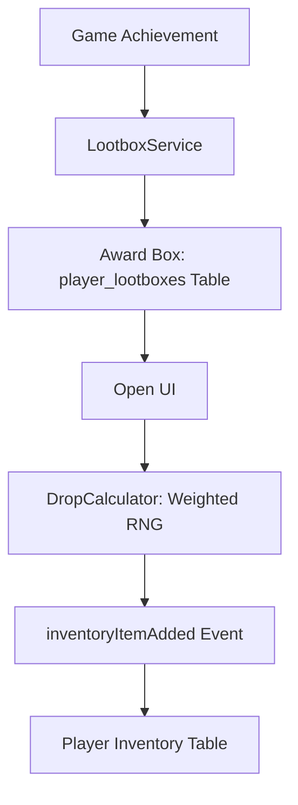

# :Slot: Lootbox & Inventory System

> **Status**: Production Ready | **Type**: Rewards & Meta-Game | **Domain**: Monetization & Retention

## :FileText: System Summary
The lootbox system forms the meta-game layer of Crypto Survivors. Players earn crypto-themed crates for their in-game achievements (cycle completion, kill streaks). These crates contain character skins, consumable power-ups, and virtual game currency.

## :Rocket: Key Features
- **Themed Rewards**: Rewards inspired by crypto mythology (Flash Loan, Gas Boost, Whale Wallet).
- :Check: **Weighted RNG Drops**: Fair drop rates optimized by rarity levels (Common, Rare, Epic, Legendary).
- :Check: **Dynamic Inventory**: Instant rewards processing into the inventory and in-game usage (Consumables).

## :Monitor: Architecture

## :Trophy: Lootbox Tiers & Reward Pool
| Rarity | Name | Theme | Icon |
| :--- | :--- | :--- | :---: |
| **Common** | Mining Crate | BTC Mining | ⛏️ |
| **Rare** | Gas Fee Box | ETH Gas Fees | ⛽ |
| **Epic** | Validator Vault | Staking & PoS | 🔐 |
| **Legendary** | Whale Wallet | Large Investors | 🐋 |

## :Settings: Technical Context
- **Services**: `LootboxService` (Rewards), `InventoryService` (Inventory management).
- **RNG Engine**: Weighted random number generation via `LootboxDropCalculator`.
- **Database**: Full synchronization with Supabase `player_lootboxes` and `player_inventory` tables.

## :Zap: Performance & Security Level
- **Performance**: Lootbox opening animations are loaded via `LazyMotion` only when needed.
- **Security**: While the opening process starts on the client, reward determination and registration are validated via server-side `verify-game` or database triggers.

---
// END OF PROTOCOL
